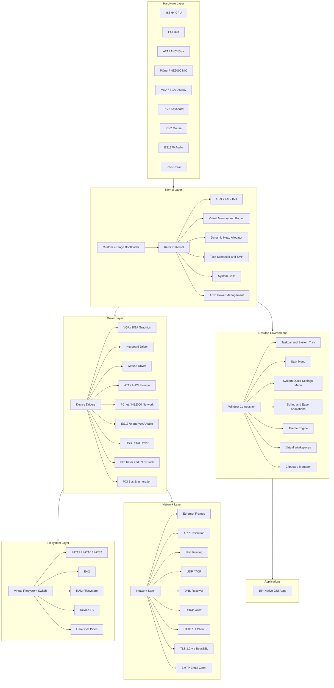
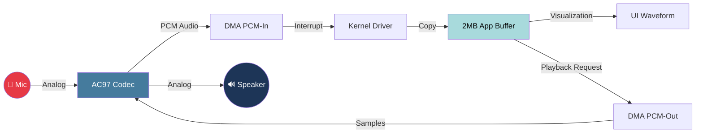
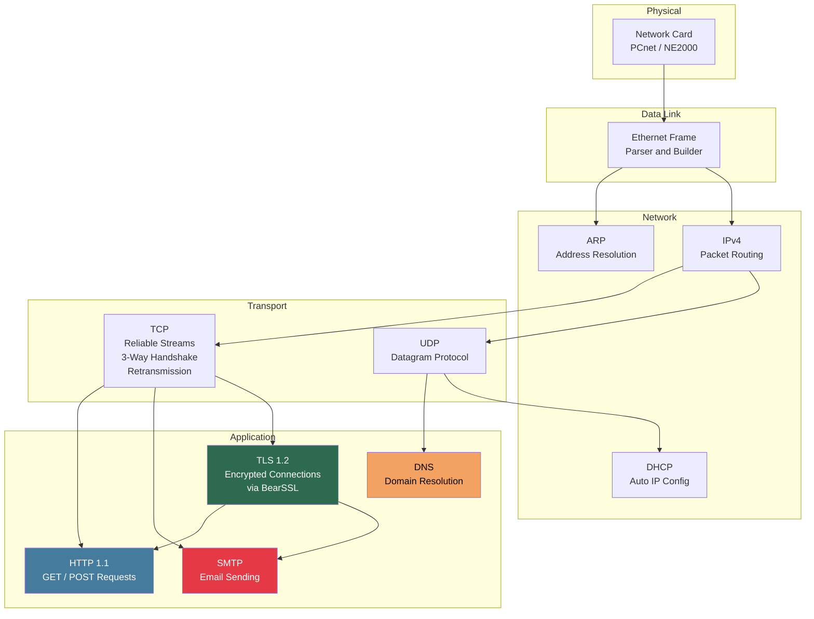
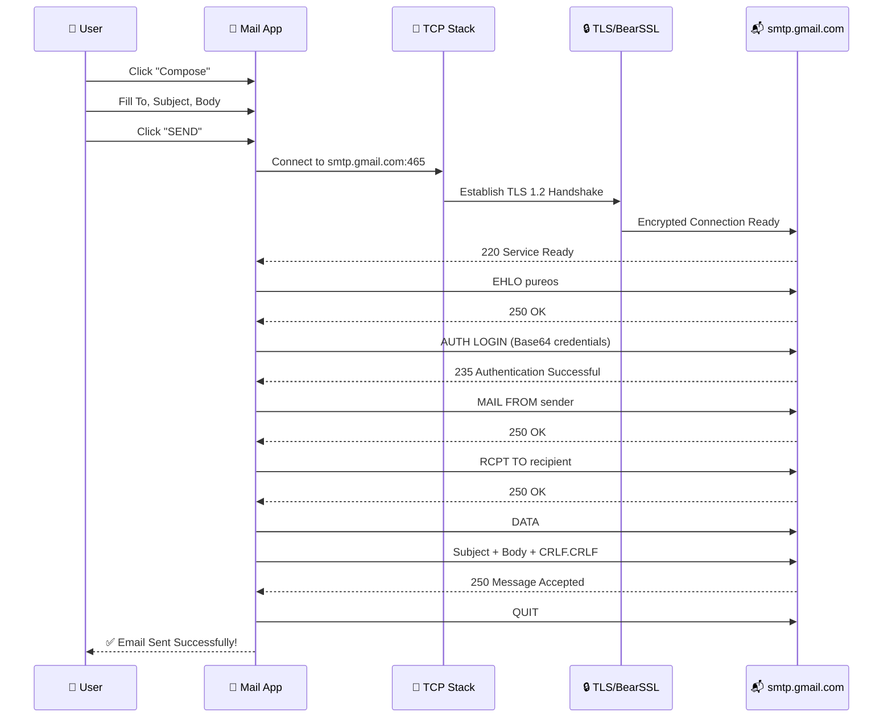
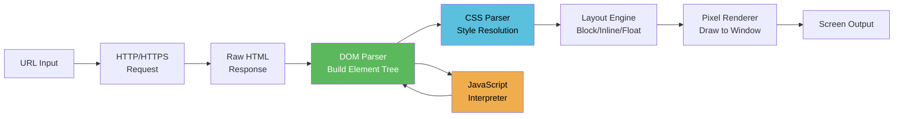
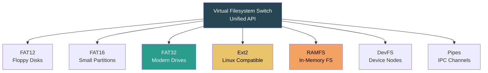
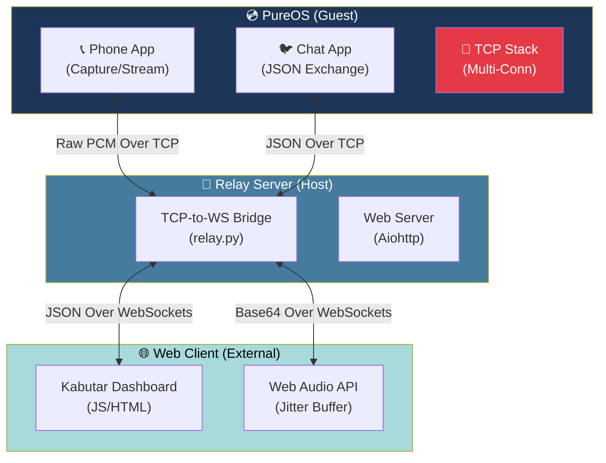

<div align="center">
  <h1>💿 PureOS</h1>
  <p><b>A custom-built x86-64 operating system with a full windowed GUI, TCP/IP networking stack, TLS encryption, and 15+ built-in desktop applications — all written from scratch in C and Assembly.</b></p>
  <br>
  
  
  
</div>

---

## 📖 Table of Contents
- [Overview](#-overview)
- [System Architecture](#-system-architecture)
- [Desktop Environment & UI](#-desktop-environment--ui)
- [Built-in Applications](#-built-in-applications)
- [Networking Stack](#-networking-stack)
- [Email Client (SMTP)](#-email-client-smtp)
- [Web Browser](#-web-browser)
- [Filesystem Support](#-filesystem-support)
- [Hardware & Drivers](#-hardware--drivers)
- [Build Instructions](#-build-instructions)
- [Email Setup Guide](#-email-setup-guide)

---

## 🌟 Overview

PureOS is a fully functional desktop operating system engineered entirely from scratch — no Linux kernel, no POSIX libraries, no borrowed OS code. Every layer is hand-written: from the bootloader and kernel, through memory management and interrupt handling, all the way up to a composited windowed desktop with animations, a TCP/IP network stack with TLS encryption, and a suite of native GUI applications.

---

## 🏗️ System Architecture

The OS is structured in clean layers, each built on top of the previous one:



---

## 🖥️ Desktop Environment & UI

PureOS features a modern, composited desktop environment with rich visual effects:

| Feature | Description |
|---|---|
| **Window Compositor** | Real-time composited rendering with proper Z-ordering, transparency, and overlapping window support |
| **Taskbar** | Windows-style taskbar showing running applications with click-to-focus switching |
| **Start Menu** | App launcher with categorized application list and quick-access shortcuts |
| **System Tray Menu** | Quick-settings panel for WiFi, Bluetooth, Volume, Brightness, and Power options |
| **System Monitor** | Live CPU and memory usage displayed with animated liquid-fill gauges |
| **Window Animations** | Smooth open/close/minimize animations powered by spring physics and easing curves |
| **Theme Engine** | Customizable color themes with dark mode support |
| **Virtual Workspaces** | Multiple desktop workspaces for organizing windows |
| **Clipboard** | System-wide copy/paste clipboard |
| **Lock Screen** | Secure password-protected lock screen with blurred background |
| **Context Menus** | Right-click context menus throughout the desktop |
| **Custom Wallpaper** | High-resolution PNG wallpaper with optimized rendering |
| **Keyboard Shortcuts** | `Alt+F4` close, window dragging, resize, and focus management |

---

## 📦 Built-in Applications

PureOS ships with **15+ native desktop applications**, all built directly into the kernel:

### System Utilities
| App | Description |
|---|---|
| 🖥️ **Terminal** | Full terminal emulator with command history, tab auto-completion, and a built-in shell supporting `ls`, `cd`, `cat`, `mkdir`, `rm`, `cp`, `mv`, `ping`, `ifconfig`, `wget`, and more |
| 📁 **File Manager** | Dual-pane graphical file manager with icon/list views, file operations (copy, move, delete, rename), and directory navigation |
| 🗂️ **Explorer** | Advanced file explorer with breadcrumb navigation, search, and detailed file information |
| 📊 **Task Manager** | Shows running windows/processes with the ability to kill unresponsive applications |
| ⚙️ **Settings** | System configuration panel with pages for Home, Personalization, Accounts, System Info, and About |
| 🔒 **Lock Screen** | Secure login screen with password input and blurred desktop background |
| 📸 **Screenshot** | Capture the current screen and save to disk |

### Creative & Productivity
| App | Description |
|---|---|
| 🎨 **Paint** | Pixel-level drawing application with freehand brush, color palette, and canvas |
| 📝 **Text Editor** | Multi-line text editor with keyboard input, scrolling, cursor navigation, and file save/load |
| 🧮 **Calculator** | Graphical calculator with button grid supporting basic arithmetic operations |

### Media & Documents
| App | Description |
|---|---|
| 🖼️ **Photos** | Image viewer supporting BMP and PNG formats with zoom and navigation |
| 🎬 **Video Player** | Embedded MPEG video playback with frame decoding and audio sync |
| 📄 **PDF Reader** | Full-featured PDF viewer powered by a native port of the **MuPDF** library — renders real PDF documents with fonts, images, and vector graphics |
| 🎙️ **Voice Recorder** | Audio recording app with AC97 PCM capture, real-time waveform visualization, and high-fidelity playback through the restored AC97 DMA engine |

#### 🎙️ Voice Recorder Architecture
The recorder interacts directly with the AC97 hardware through a high-performance DMA-backed capture system:



### Internet & Communication
| App | Description |
|---|---|
| 🌐 **Web Browser** | Built-in web browser with custom HTML/DOM parser, CSS engine, JavaScript interpreter, and layout renderer — connects over raw TCP sockets |
| 📧 **Mail Client** | Full SMTP email client that can send real emails through Gmail — see [Email Setup Guide](#-email-setup-guide) below |
| 🐦 **PureChat** | Real-time bidirectional chat client with newline-delimited JSON protocol and kernel-level network polling |
| 📞 **Phone** | Real-time voice calling app with 48kHz bidirectional streaming, 170ms audio chunking, and jitter-buffered playback |

---

## 🌐 Networking Stack

PureOS implements a **complete TCP/IP networking stack from scratch** — no external libraries for the core protocols:



### Protocol Capabilities

| Protocol | Implementation Details |
|---|---|
| **Ethernet** | Raw frame construction and parsing, MAC address handling |
| **ARP** | Address Resolution Protocol with ARP cache and request/reply |
| **IPv4** | Full IP packet routing, header checksum, fragmentation support |
| **DHCP** | Automatic IP address, subnet, gateway and DNS configuration |
| **UDP** | Connectionless datagram transport for DNS and DHCP |
| **TCP** | Upgraded implementation: Support for **4 concurrent connections**, 3-way handshake, sequence tracking, ACK management, retransmission, and non-blocking draining |
| **DNS** | Domain name resolution with query building and response parsing |
| **HTTP 1.1** | GET/POST requests, header parsing, chunked transfer decoding |
| **TLS 1.2** | Secure encrypted connections via an integrated **BearSSL** library port (RSA, AES, SHA-256, X.509 certificates) |
| **SMTP** | Authenticated email sending with STARTTLS / direct TLS (port 465) |

---

## 📧 Email Client (SMTP)

The built-in Mail app supports **composing and sending real emails** through Gmail's SMTP servers:



### Mail App Features
- **Compose Mode** — To, Subject, and Body fields with Tab key navigation
- **Account Sidebar** — Multiple account support stored in `/mail/` directory
- **Message List** — View received emails with sender and subject preview
- **Message Reader** — Full email body display panel
- **POP3 Sync** — Fetch emails from POP3 servers (with demo/mock mode fallback)
- **Live SMTP Send** — Real email delivery through Gmail's secure SMTP servers

---

## 🌐 Web Browser

The PureOS browser is a fully native web renderer — no WebKit, no Chromium, no external engine:



**Components:**
| Module | File | Capability |
|---|---|---|
| **DOM Parser** | `dom.c` | Parses raw HTML into a DOM element tree with tag attributes |
| **CSS Engine** | `css.c` | Parses inline and `<style>` CSS, resolves properties per element |
| **Layout Engine** | `layout.c` | Computes block/inline positioning, width/height, margins, padding |
| **JS Interpreter** | `js.c` | Basic JavaScript execution: variables, functions, DOM manipulation |
| **Browser Shell** | `browser.c` | URL bar, navigation, page fetch over HTTP/HTTPS, rendering orchestration |

---

## 💾 Filesystem Support



| Filesystem | Capabilities |
|---|---|
| **FAT12/16/32** | Full read/write, directory listing, file creation/deletion, long filename support |
| **Ext2** | Read support for Linux-compatible ext2 partitions |
| **RAMFS** | Fast in-memory filesystem for temporary data and mail storage |
| **DevFS** | Device file nodes (similar to Linux `/dev/`) |
| **Pipes** | Unix-style inter-process communication pipes |

---

## 🔧 Hardware & Drivers

| Category | Drivers |
|---|---|
| **Display** | VGA text mode, VGA graphics mode, Bochs BGA (high-res framebuffer) |
| **Input** | PS/2 Keyboard (scancode translation, shift/caps), PS/2 Mouse (movement + buttons) |
| **Storage** | ATA PIO, AHCI (SATA) |
| **Network** | AMD PCnet-PCI II, NE2000 (Realtek 8029) |
| **Audio** | Intel AC97 codec (recording & playback via DMA), Ensoniq ES1370 (AudioPCI), WAV file decoder and playback |
| **USB** | UHCI host controller, USB device enumeration |
| **System** | PCI bus enumeration, PIT timer, RTC real-time clock, PC speaker, ACPI, APIC, SMP multi-core |

---

## 🛠️ Build Instructions

### Requirements
- **OS:** Windows 10/11
- **Compiler:** `x86_64-elf-gcc` cross-compiler (included in `tools/` directory)
- **Assembler:** NASM
- **Scripting:** Python 3
- **Emulator:** Bochs, QEMU, or VirtualBox

### Steps

**1. First-time setup — build the PDF library (only needed once):**
```powershell
powershell -ExecutionPolicy Bypass -File build_mupdf.ps1
```

**2. Build the entire OS:**
```bat
.\build.bat
```

This compiles the bootloader, kernel, all drivers, GUI, applications, and networking stack, then produces:
- `os-image.bin` — Raw bootable binary
- `pureos.img` — Ready-to-run disk image for emulators

**3. Run in an emulator (Bochs example):**
```bat
.\run_bochs.bat
```

---

## 📧 Email Setup Guide

PureOS can send **real emails** through Gmail. To configure:

1. **Enable 2-Step Verification** on your Google Account
2. Go to **Google Account → Security → App Passwords**
3. Generate a new App Password (format: `abcd efgh ijkl mnop`)
4. Open `src/apps/mail/mail_app.c` and update line ~376:
   ```c
   const char *user = "your_email@gmail.com";
   const char *pass = "abcd efgh ijkl mnop";  // Your 16-char App Password
   ```
5. Rebuild with `.\build.bat` and launch the OS
6. Open **Mail** from the Start Menu → Click **Compose** → Fill in recipient, subject, body → Click **SEND**

> ⚠️ **Security Warning:** Never commit your real App Password to a public Git repository. Always replace it with a placeholder before pushing to GitHub.

---

## 🐦 PureChat & Relay Server

PureOS includes a fully functional real-time chat system inspired by modern messaging apps. It consists of a native GUI client and a lightweight Python-based relay server for cross-platform synchronization (PC/Mobile).

### 🖥️ Communication Architecture

The following diagram illustrates how PureOS achieves real-time bidirectional communication by bridging raw TCP sockets to modern Web technologies through the Python relay:



### 🐍 Python Relay Server (`server/relay.py`)
- **Unified Port** — Serving both the web dashboard and WebSocket messaging on a single port (7862) for easy Ngrok/Cloud deployment.
- **TCP Bridge** — Bridging raw TCP sockets (Port 7860) from PureOS to modern WebSockets (Port 7861/7862).
- **Premium Dashboard** — Modern, responsive web interface with a custom 'KABUTAR' splash screen and glassmorphic UI.

---

## 📄 License

This project is licensed under the [MIT License](LICENSE).

---

<div align="center">
  <b>Built with ❤️ from scratch — no Linux, no POSIX, no borrowed OS code.</b>
</div>
