<div align="center">
  <h1>💿 PureOS</h1>
  <p><b>A custom-built x86-64 operating system with a full windowed GUI, TCP/IP networking stack, TLS encryption, and 16+ built-in desktop applications — all written from scratch in C and Assembly.</b></p>
  <br>
  
  
  
</div>

---

## 📖 Table of Contents
- [Overview](#-overview)
- [System Architecture](#-system-architecture)
- [Desktop Environment & UI](#-desktop-environment--ui)
- [Built-in Applications](#-built-in-applications)
- [Networking Stack](#-networking-stack)
- [Email Client (SMTP)](#-email-client-smtp)
- [Web Browser](#-web-browser)
- [Bluetooth Subsystem (Physical Radio)](#-bluetooth-subsystem-physical-radio)
- [USB Smartphone Storage & MTP](#-usb-smartphone-storage--mtp)
- [Linux Binary Compatibility Layer](#-linux-binary-compatibility-layer)
- [Command-Line Networking & `curl`](#-command-line-networking--curl)
- [Filesystem Support](#-filesystem-support)
- [Hardware & Drivers](#-hardware--drivers)
- [Build Instructions](#-build-instructions)
- [Email Setup Guide](#-email-setup-guide)
- [PureChat & Relay Server](#-purechat--relay-server)

---

## 🌟 Overview

PureOS is a fully functional desktop operating system engineered entirely from scratch — no Linux kernel, no POSIX libraries, no borrowed OS code. Every layer is hand-written: from the bootloader and kernel, through memory management and interrupt handling, all the way up to a composited windowed desktop with animations, a TCP/IP network stack with TLS encryption, a native Linux binary compatibility layer capable of executing standard Linux ELF64 binaries like `curl`, a bare-metal Rust xHCI USB 3.0 stack with smartphone MTP file transfer, and physical Bluetooth radio communication with real hardware.

---

## 🏗️ System Architecture

The OS is structured in clean layers, each built on top of the previous one:

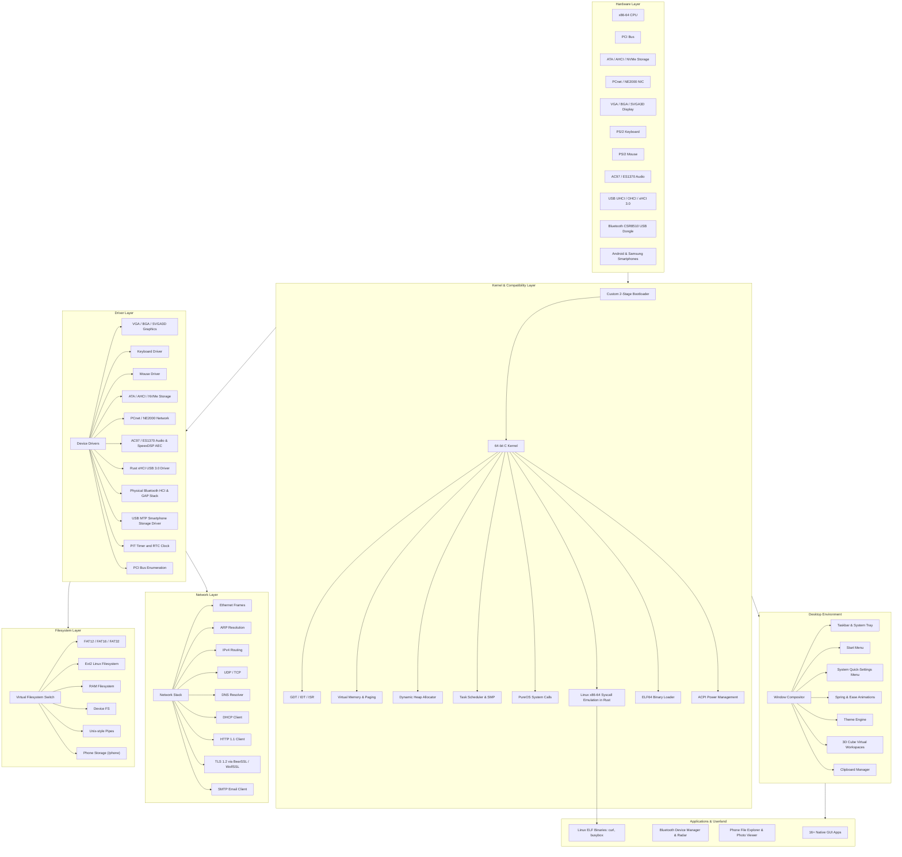
```mermaid
flowchart TD
    subgraph HW["Hardware Layer"]
        CPU["x86-64 CPU"]
        PCI["PCI Bus"]
        DISK["ATA / AHCI / NVMe Storage"]
        NIC["PCnet / NE2000 NIC"]
        GPU["VGA / BGA / SVGA3D Display"]
        KBD["PS/2 Keyboard"]
        MOUSE["PS/2 Mouse"]
        AUDIO["AC97 / ES1370 Audio"]
        USB_HW["USB UHCI / OHCI / xHCI 3.0"]
        BT_HW["Bluetooth CSR8510 USB Dongle"]
        PHONE_HW["Android & Samsung Smartphones"]
    end

    subgraph KRN["Kernel & Compatibility Layer"]
        BOOT["Custom 2-Stage Bootloader"] --> KERNEL["64-bit C Kernel"]
        KERNEL --> GDT["GDT / IDT / ISR"]
        KERNEL --> PAGING["Virtual Memory & Paging"]
        KERNEL --> HEAP["Dynamic Heap Allocator"]
        KERNEL --> SCHED["Task Scheduler & SMP"]
        KERNEL --> SYSCALL["PureOS System Calls"]
        KERNEL --> LINUX_ABI["Linux x86-64 Syscall Emulation in Rust"]
        KERNEL --> ELF_LOADER["ELF64 Binary Loader"]
        KERNEL --> ACPI_K["ACPI Power Management"]
    end

    subgraph DRV["Driver Layer"]
        DRIVERS["Device Drivers"]
        DRIVERS --> VGA_D["VGA / BGA / SVGA3D Graphics"]
        DRIVERS --> KBD_D["Keyboard Driver"]
        DRIVERS --> MOUSE_D["Mouse Driver"]
        DRIVERS --> ATA_D["ATA / AHCI / NVMe Storage"]
        DRIVERS --> NET_D["PCnet / NE2000 Network"]
        DRIVERS --> AUDIO_D["AC97 / ES1370 Audio & SpeexDSP AEC"]
        DRIVERS --> XHCI_D["Rust xHCI USB 3.0 Driver"]
        DRIVERS --> BT_D["Physical Bluetooth HCI & GAP Stack"]
        DRIVERS --> MTP_D["USB MTP Smartphone Storage Driver"]
        DRIVERS --> TIMER_D["PIT Timer and RTC Clock"]
        DRIVERS --> PCI_D["PCI Bus Enumeration"]
    end

    subgraph FSL["Filesystem Layer"]
        VFS["Virtual Filesystem Switch"]
        VFS --> FAT["FAT12 / FAT16 / FAT32"]
        VFS --> EXT2["Ext2 Linux Filesystem"]
        VFS --> RAMFS["RAM Filesystem"]
        VFS --> DEVFS["Device FS"]
        VFS --> PIPES["Unix-style Pipes"]
        VFS --> MTP_FS["Phone Storage (/phone)"]
    end

    subgraph NETL["Network Layer"]
        NET_STACK["Network Stack"]
        NET_STACK --> ETH["Ethernet Frames"]
        NET_STACK --> ARP["ARP Resolution"]
        NET_STACK --> IPV4["IPv4 Routing"]
        NET_STACK --> ICMP_N["UDP / TCP"]
        NET_STACK --> DNS_N["DNS Resolver"]
        NET_STACK --> DHCP_N["DHCP Client"]
        NET_STACK --> HTTP_N["HTTP 1.1 Client"]
        NET_STACK --> TLS_N["TLS 1.2 via BearSSL / WolfSSL"]
        NET_STACK --> SMTP_N["SMTP Email Client"]
    end

    subgraph DE["Desktop Environment"]
        COMPOSITOR["Window Compositor"]
        COMPOSITOR --> TASKBAR_D["Taskbar & System Tray"]
        COMPOSITOR --> STARTMENU_D["Start Menu"]
        COMPOSITOR --> SYSMENU_D["System Quick-Settings Menu"]
        COMPOSITOR --> ANIMATIONS["Spring & Ease Animations"]
        COMPOSITOR --> THEMES["Theme Engine"]
        COMPOSITOR --> WORKSPACES["3D Cube Virtual Workspaces"]
        COMPOSITOR --> CLIPBOARD_D["Clipboard Manager"]
    end

    subgraph APP["Applications & Userland"]
        APPS["16+ Native GUI Apps"]
        BT_APP["Bluetooth Device Manager & Radar"]
        PHONE_APP["Phone File Explorer & Photo Viewer"]
        LINUX_BIN["Linux ELF Binaries: curl, busybox"]
    end

    HW --> KRN
    KRN --> DRV
    DRV --> FSL
    DRV --> NETL
    KRN --> DE
    DE --> APP
    LINUX_ABI --> LINUX_BIN
```

---

## 🖥️ Desktop Environment & UI

PureOS features a modern, composited desktop environment with rich visual effects:

| Feature | Description |
|---|---|
| **Window Compositor** | Real-time composited rendering with proper Z-ordering, transparency, and overlapping window support |
| **Taskbar** | Windows-style taskbar showing running applications with click-to-focus switching |
| **Start Menu** | App launcher with categorized application list and quick-access shortcuts |
| **System Tray Menu** | Quick-settings panel for WiFi, Bluetooth, Volume, Brightness, and Power options |
| **System Monitor** | Live CPU and memory usage displayed with animated liquid-fill gauges |
| **Window Animations** | Smooth open/close/minimize animations powered by spring physics and easing curves |
| **Theme Engine** | Customizable color themes with dark mode support |
| **Virtual Workspaces** | Multiple desktop workspaces for organizing windows |
| **Clipboard** | System-wide copy/paste clipboard |
| **Lock Screen** | Secure password-protected lock screen with blurred background |
| **Context Menus** | Right-click context menus throughout the desktop |
| **Custom Wallpaper** | High-resolution PNG wallpaper with optimized rendering |
| **Keyboard Shortcuts** | `Alt+F4` close, window dragging, resize, and focus management |

### 🧊 3D Desktop Cube & Multi-Workspace

PureOS features a mathematically perfect, hardware-independent **3D Workspace Cube**. Instead of instantly snapping between virtual desktops, grabbing the top edge of the screen and dragging horizontally seamlessly transitions the 2D window manager into a fully 3D convex projection. The active workspaces are mapped to the faces of an outer cube, which rotates in real-time following your mouse movements.

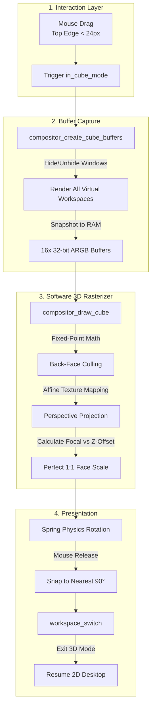
```mermaid
graph TD
    subgraph 1. Interaction Layer
        GESTURE[Mouse Drag<br>Top Edge < 24px] --> MODE[Trigger in_cube_mode]
    end

    subgraph 2. Buffer Capture
        MODE --> SNAPSHOT[compositor_create_cube_buffers]
        SNAPSHOT -->|Hide/Unhide Windows| VIRT[Render All Virtual Workspaces]
        VIRT -->|Snapshot to RAM| BUF[16x 32-bit ARGB Buffers]
    end

    subgraph 3. Software 3D Rasterizer
        BUF --> PROJ[compositor_draw_cube]
        PROJ -->|Fixed-Point Math| CULL[Back-Face Culling]
        CULL -->|Affine Texture Mapping| PERS[Perspective Projection]
        PERS -->|Calculate Focal vs Z-Offset| SCALE[Perfect 1:1 Face Scale]
    end

    subgraph 4. Presentation
        SCALE --> ANIM[Spring Physics Rotation]
        ANIM -->|Mouse Release| SNAP[Snap to Nearest 90°]
        SNAP --> SWITCH[workspace_switch]
        SWITCH -->|Exit 3D Mode| DESKTOP[Resume 2D Desktop]
    end
```

**Key Engineering Highlights:**
- **Zero-Dependency 3D Math:** The projection engine does not rely on OpenGL or GPU acceleration. It computes perspective geometry (focal length, camera Z-offset, and trigonometric rotations) entirely in native C. 
- **Fixed-Point Optimization:** To maintain 60 FPS during software rendering, the inner texture-mapping loop abandons slow floating-point division in favor of integer fixed-point arithmetic (`(screen_height << 16) / col_h`), eliminating millions of CPU cycles per frame.
- **Dynamic Outer Convexity:** The focal length and camera offset are precisely balanced (`focal = width * 1.0`, `cube_z = width * 1.5`) so that the front face of the convex cube scales perfectly to 1:1, seamlessly matching the standard 2D desktop bounds.

---

## 📦 Built-in Applications

PureOS ships with **16+ native desktop applications**, all built directly into the kernel:

### System Utilities
| App | Description |
|---|---|
| 🖥️ **Terminal** | Full terminal emulator with command history, tab auto-completion, and a built-in shell supporting `ls`, `cd`, `cat`, `mkdir`, `rm`, `cp`, `mv`, `ping`, `ifconfig`, `wget`, and more |
| 📁 **File Manager** | Dual-pane graphical file manager with icon/list views, file operations (copy, move, delete, rename), and directory navigation |
| 🗂️ **Explorer** | Advanced file explorer with breadcrumb navigation, search, and detailed file information |
| 📊 **Task Manager** | Shows running windows/processes with the ability to kill unresponsive applications |
| ⚙️ **Settings** | System configuration panel with pages for Home, Personalization, Accounts, System Info, and About |
| 🔒 **Lock Screen** | Secure login screen with password input and blurred desktop background |
| 📸 **Screenshot** | Capture the current screen and save to disk |

### Creative & Productivity
| App | Description |
|---|---|
| 🎨 **Paint** | Pixel-level drawing application with freehand brush, color palette, and canvas |
| 📝 **Text Editor** | Multi-line text editor with keyboard input, scrolling, cursor navigation, and file save/load |
| 🧮 **Calculator** | Graphical calculator with button grid supporting basic arithmetic operations |
| 📊 **PurePoint** | Native presentation suite with 16:9 slide canvas, slide deck sidebar, interactive text/shape editing, Undo/Redo, color themes, file saving/loading, and F5 fullscreen slideshow mode |

### Media & Documents
| App | Description |
|---|---|
| 🖼️ **Photos** | Image viewer supporting BMP and PNG formats with zoom and navigation |
| 🎬 **Video Player** | Embedded MPEG video playback with frame decoding and audio sync |
| 📄 **PDF Reader** | Full-featured PDF viewer powered by a native port of the **MuPDF** library — renders real PDF documents with fonts, images, and vector graphics |
| 🎙️ **Voice Recorder** | Audio recording app with AC97 PCM capture, real-time waveform visualization, and high-fidelity playback through the restored AC97 DMA engine |
| 🎵 **Music Player** | MP3 audio player with real-time UI synchronization, custom `dr_mp3` decoding, and flawless software resampling to native 48kHz stereo |
| 🏓 **Pong** | Classic arcade game with 3 modes (1P vs Bot, 2P Local, Bot vs Bot), AC97 synthesized sound effects, and smooth keyboard-polled paddle controls |
| 🏎️ **Hill Climb Racing** | A fully physics-driven 2D racing game clone with rigid body mechanics, procedural terrain generation, and a deterministic coin collection system |

#### 🏎️ Hill Climb Racing Architecture
The Hill Climb Racing clone is a physics-driven arcade game written entirely from scratch, bypassing traditional game engines to run directly on the PureOS custom graphics pipeline.

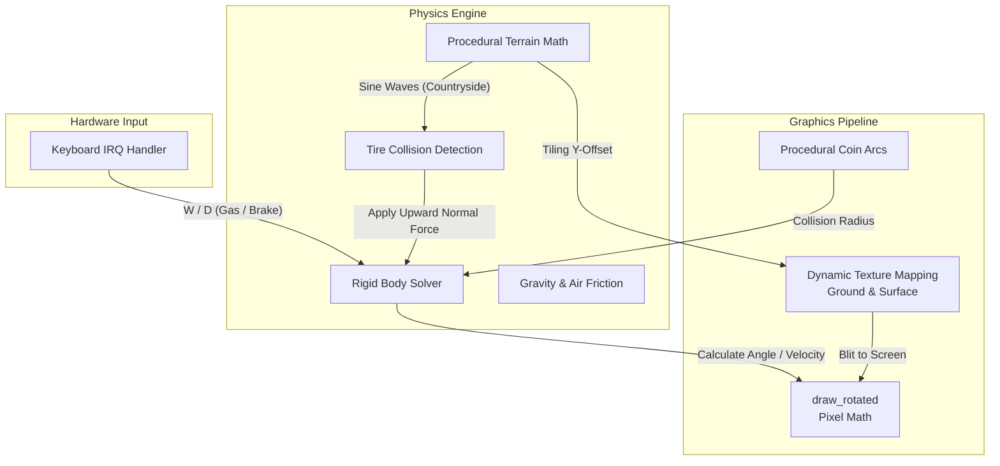
```mermaid
graph TD
    subgraph Physics Engine
        RIGID[Rigid Body Solver]
        TERRAIN[Procedural Terrain Math]
        GRAV[Gravity & Air Friction]
        COLLIDE[Tire Collision Detection]
    end

    subgraph Graphics Pipeline
        DRAW_ROT[draw_rotated<br>Pixel Math]
        TEX[Dynamic Texture Mapping<br>Ground & Surface]
        COINS[Procedural Coin Arcs]
    end

    subgraph Hardware Input
        KBD[Keyboard IRQ Handler]
    end

    KBD -->|"W / D (Gas / Brake)"| RIGID
    RIGID -->|"Calculate Angle / Velocity"| DRAW_ROT
    TERRAIN -->|"Sine Waves (Countryside)"| COLLIDE
    COLLIDE -->|"Apply Upward Normal Force"| RIGID
    TERRAIN -->|"Tiling Y-Offset"| TEX
    TEX -->|"Blit to Screen"| DRAW_ROT
    COINS -->|"Collision Radius"| RIGID
```

**Key Engineering Highlights:**
- **Rigid Body Solver:** A custom 2D physics engine calculating angular velocity, momentum, rotational friction, and tangent-based slope gravity to accurately mimic real-world tire traction and backflips (with -π to π normalization).
- **Procedural Generation:** The game world is infinite. The terrain is dynamically generated using multiple high and low-frequency sine waves (e.g., matching the classic "Countryside" map), allowing for endless, deterministic gameplay.
- **Dynamic Texture Tiling:** The screen-space renderer intelligently calculates world-to-screen coordinate mappings to tile PNG textures seamlessly across the procedurally generated jagged hills.
- **Deterministic Spawning:** Coins are spawned slightly ahead of the screen in pre-determined, classic arcade formations (Small Lines, High Arcs, Long Lines, and Triangles). Different denominations (5, 25, 100, 500) are procedurally loaded from disk and spawned into the world.

#### 🎵 Music Player Architecture
The Music Player is a complete end-to-end MP3 playback system deeply integrated with the OS kernel and audio hardware to provide flawless, skip-free audio and real-time UI updates:

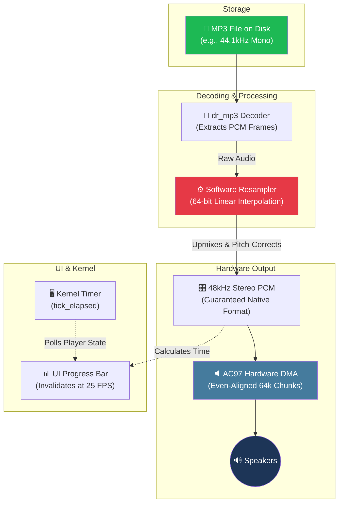
```mermaid
graph TD
    subgraph Storage
        MP3["🎵 MP3 File on Disk<br/>(e.g., 44.1kHz Mono)"]
    end

    subgraph Decoding & Processing
        DRMP3["🧠 dr_mp3 Decoder<br/>(Extracts PCM Frames)"]
        RESAMP["⚙️ Software Resampler<br/>(64-bit Linear Interpolation)"]
    end

    subgraph Hardware Output
        PCM["🎛️ 48kHz Stereo PCM<br/>(Guaranteed Native Format)"]
        AC97["🔈 AC97 Hardware DMA<br/>(Even-Aligned 64k Chunks)"]
        SPK(("🔊 Speakers"))
    end

    subgraph UI & Kernel
        TICK["🖥️ Kernel Timer<br/>(tick_elapsed)"]
        UI["📊 UI Progress Bar<br/>(Invalidates at 25 FPS)"]
    end

    MP3 --> DRMP3
    DRMP3 -->|"Raw Audio"| RESAMP
    RESAMP -->|"Upmixes & Pitch-Corrects"| PCM
    PCM --> AC97
    AC97 --> SPK

    TICK -.->|"Polls Player State"| UI
    PCM -.->|"Calculates Time"| UI

    style MP3 fill:#1DB954,color:#fff
    style AC97 fill:#457b9d,color:#fff
    style RESAMP fill:#e63946,color:#fff
    style SPK fill:#1d3557,color:#fff
```

**Key Engineering Highlights:**
- **Software Resampler Bypass:** VirtualBox and many legacy physical AC97 codecs have buggy implementations of Variable Rate Audio (VRA), often ignoring requests to play 44.1kHz audio and playing it too fast (sounding "robotic"). The Music Player completely bypasses this hardware limitation by passing the audio through a highly optimized **64-bit linear interpolation software resampler** that flawlessly pitch-corrects and upmixes all MP3s into pristine 48,000Hz Stereo before hitting the hardware.
- **DMA Phase Alignment:** The OS strictly aligns all hardware DMA chunk lengths to even numbers (`65534`). This prevents the disastrous "channel swapping" phase-cancellation bug that occurs when an audio driver feeds an odd number of samples to an inherently paired stereo hardware interface.
- **Kernel-Polled UI Sync:** Instead of relying on manual window-resize events to trigger a redraw, the Music Player's progress bar is securely hooked directly into the kernel's main execution loop (`tick_elapsed`). The kernel polls the player's audio progress and selectively invalidates only the bottom 90 pixels of the window at a rate-limited 25 FPS, ensuring silky-smooth animations with virtually zero CPU overhead.

#### 🎙️ Voice Recorder Architecture
The recorder interacts directly with the AC97 hardware through a high-performance DMA-backed capture system:

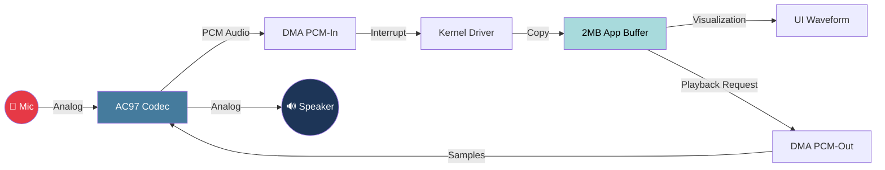
```mermaid
graph LR
    MIC((🎤 Mic)) -->|Analog| CODEC[AC97 Codec]
    CODEC -->|PCM Audio| DMA_IN[DMA PCM-In]
    DMA_IN -->|Interrupt| KRN[Kernel Driver]
    KRN -->|Copy| BUF[2MB App Buffer]
    
    BUF -->|Visualization| WAVE[UI Waveform]
    
    BUF -->|Playback Request| DMA_OUT[DMA PCM-Out]
    DMA_OUT -->|Samples| CODEC
    CODEC -->|Analog| SPK((🔊 Speaker))

    style MIC fill:#e63946,color:#fff
    style SPK fill:#1d3557,color:#fff
    style BUF fill:#a8dadc,color:#000
    style CODEC fill:#457b9d,color:#fff
```

### Internet & Communication
| App | Description |
|---|---|
| 📞 **Phone** | Modern voice calling app with circular dialpad, integrated contacts, 48kHz bidirectional streaming, and jitter-buffered playback |

---

## 🏓 Pong — Native Arcade Game

PureOS includes a fully native implementation of the classic 1972 Pong arcade game, deeply integrated into the kernel's event loop with authentic sound effects and AI opponents.

### Game Modes

| Mode | Description | Controls |
|------|-------------|----------|
| **1 Player** | You vs AI Bot with trajectory prediction | ↑↓ Arrow Keys |
| **2 Players** | Local multiplayer on the same keyboard | P1: `W`/`S` — P2: ↑↓ Arrow Keys |
| **Bot vs Bot** | Spectator mode — two AIs battle it out | None (just watch!) |

### System Integration

The game hooks directly into the kernel's main tick loop for frame-perfect updates:

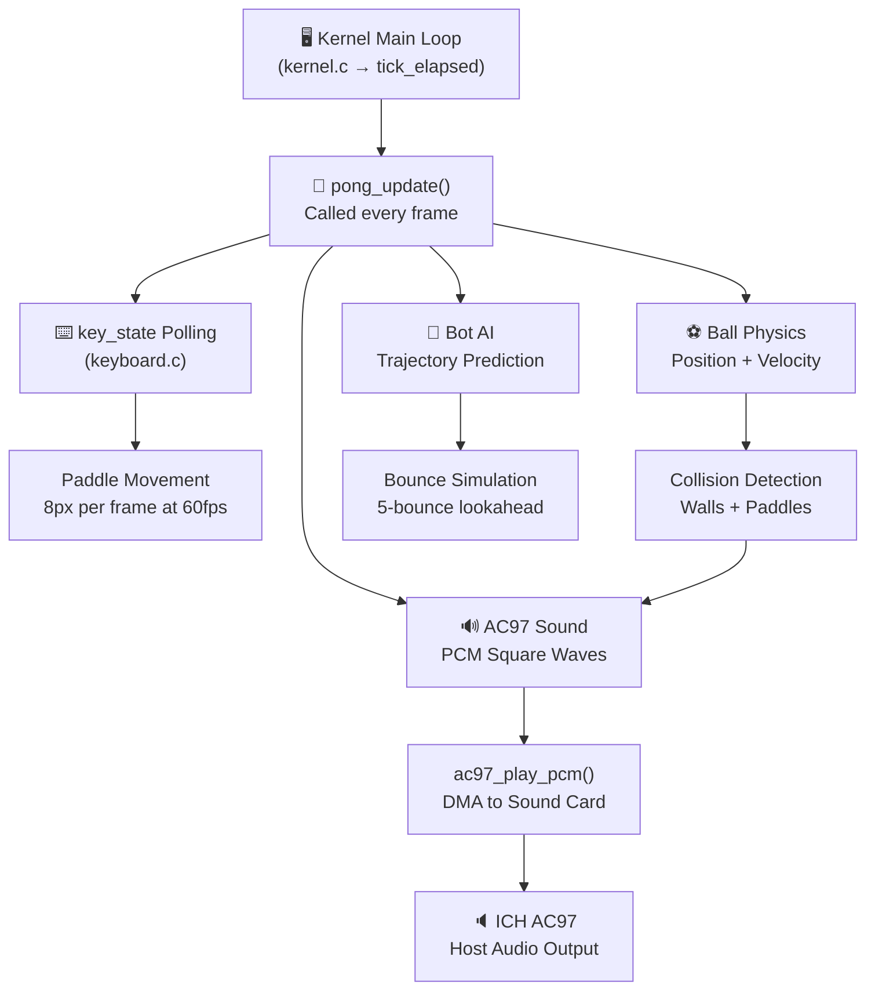
```mermaid
graph TD
    A["🖥️ Kernel Main Loop<br/>(kernel.c → tick_elapsed)"] --> B["🏓 pong_update()<br/>Called every frame"]
    B --> C["⌨️ key_state Polling<br/>(keyboard.c)"]
    B --> D["⚽ Ball Physics<br/>Position + Velocity"]
    B --> E["🤖 Bot AI<br/>Trajectory Prediction"]
    B --> F["🔊 AC97 Sound<br/>PCM Square Waves"]
    
    C --> G["Paddle Movement<br/>8px per frame at 60fps"]
    D --> H["Collision Detection<br/>Walls + Paddles"]
    H --> F
    E --> I["Bounce Simulation<br/>5-bounce lookahead"]
    
    F --> L["ac97_play_pcm()<br/>DMA to Sound Card"]
    L --> M["🔈 ICH AC97<br/>Host Audio Output"]
```

### Audio — Authentic 1972 Arcade Sounds via AC97

Instead of using the primitive PC Speaker, Pong synthesizes digital square-wave PCM buffers at game startup and plays them through the AC97 sound card via DMA — the same audio hardware used by the Voice Recorder and Phone apps:

| Game Event | Frequency | Duration | Sound Character |
|-----------|-----------|----------|------------------|
| Ball → Wall | 226 Hz | 16 ms | Quick, low "tick" |
| Ball → Paddle | 459 Hz | 96 ms | Satisfying mid "boop" |
| Player Scores | 490 Hz | 257 ms | Long, harsh buzz |

> **Historical Note:** 459 Hz is exactly 2× 226 Hz — a perfect octave. Allan Alcorn designed the original 1972 Pong audio using the arcade machine's video sync frequencies.

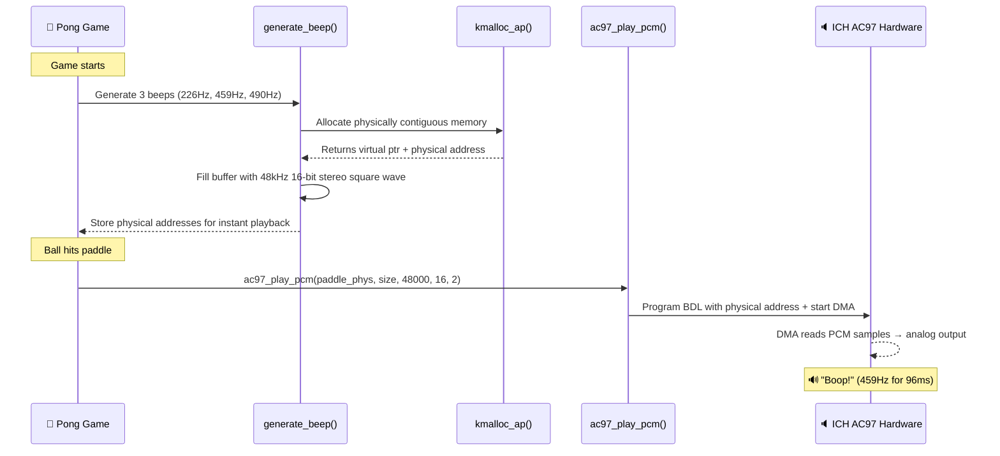
```mermaid
sequenceDiagram
    participant P as 🏓 Pong Game
    participant G as generate_beep()
    participant K as kmalloc_ap()
    participant A as ac97_play_pcm()
    participant H as 🔈 ICH AC97 Hardware

    Note over P: Game starts
    P->>G: Generate 3 beeps (226Hz, 459Hz, 490Hz)
    G->>K: Allocate physically contiguous memory
    K-->>G: Returns virtual ptr + physical address
    G->>G: Fill buffer with 48kHz 16-bit stereo square wave
    G-->>P: Store physical addresses for instant playback

    Note over P: Ball hits paddle
    P->>A: ac97_play_pcm(paddle_phys, size, 48000, 16, 2)
    A->>H: Program BDL with physical address + start DMA
    H-->>H: DMA reads PCM samples → analog output
    Note over H: 🔊 "Boop!" (459Hz for 96ms)
```

### Input — Zero-Delay Keyboard Polling

Standard keyboard input suffers from the ~500ms "typematic delay" (press → pause → repeat). Pong bypasses this entirely by polling a global `key_state[256]` array that tracks real-time key held state at the hardware interrupt level:

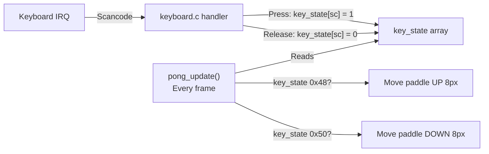
```mermaid
graph LR
    A["Keyboard IRQ"] -->|"Scancode"| B["keyboard.c handler"]
    B -->|"Press: key_state[sc] = 1"| C["key_state array"]
    B -->|"Release: key_state[sc] = 0"| C
    
    D["pong_update()<br/>Every frame"]--> |"Reads"| C
    D -->|"key_state 0x48?"| E["Move paddle UP 8px"]
    D -->|"key_state 0x50?"| F["Move paddle DOWN 8px"]
```

> The paddle responds instantly on press and stops instantly on release — no stutter, no delay.

### Bot AI — Trajectory Prediction with Bounce Simulation

The AI doesn't simply follow the ball. It calculates the ball's predicted arrival point by simulating up to 5 wall bounces ahead:

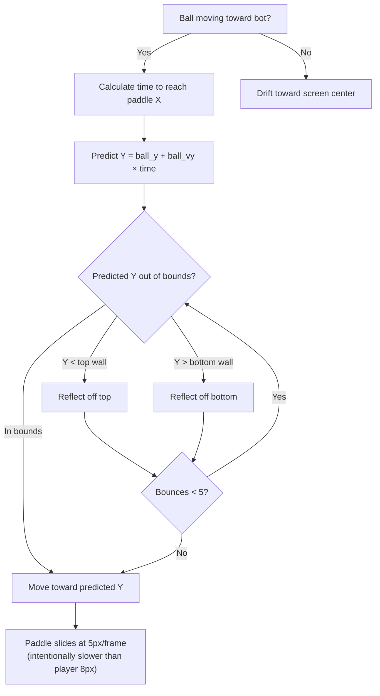
```mermaid
graph TD
    A["Ball moving toward bot?"] -->|Yes| B["Calculate time to reach paddle X"]
    A -->|No| C["Drift toward screen center"]
    B --> D["Predict Y = ball_y + ball_vy × time"]
    D --> E{"Predicted Y out of bounds?"}
    E -->|"Y < top wall"| F["Reflect off top"]
    E -->|"Y > bottom wall"| G["Reflect off bottom"]
    E -->|"In bounds"| H["Move toward predicted Y"]
    F --> I{"Bounces < 5?"}
    G --> I
    I -->|Yes| E
    I -->|No| H
    H --> J["Paddle slides at 5px/frame<br/>(intentionally slower than player 8px)"]
```

In **Bot vs Bot** mode, the two AIs have slightly different reaction speeds (5.0 vs 5.5 px/frame) and dead zones (±10 vs ±8 px) to ensure asymmetric, interesting matches.

## 🌐 Networking Stack

PureOS implements a robust TCP/IP networking stack powered by **lwIP (Lightweight IP)**, the industry-standard embedded network stack:

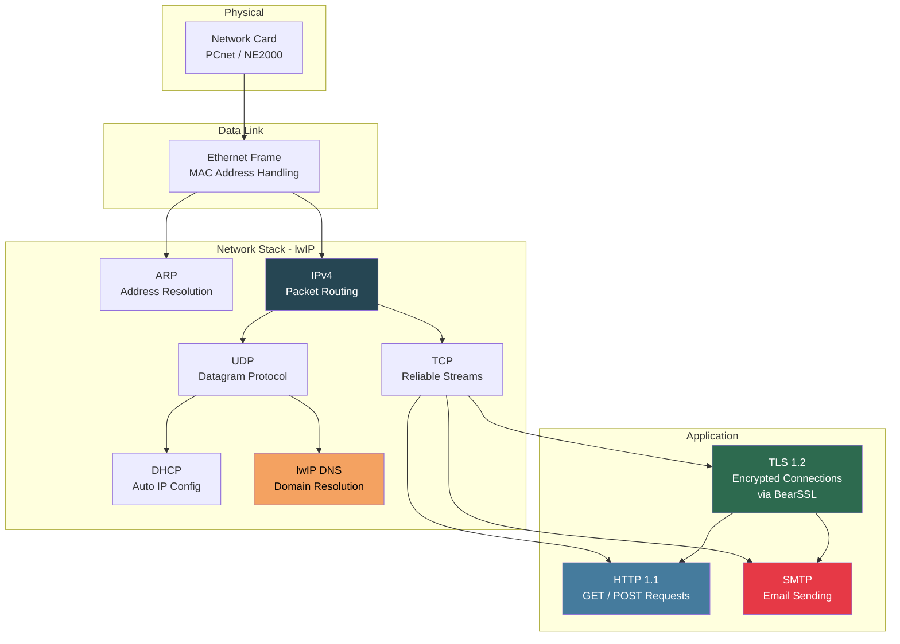
```mermaid
graph TB
    subgraph Physical
        NIC[Network Card<br>PCnet / NE2000]
    end

    subgraph Data Link
        ETH[Ethernet Frame<br>MAC Address Handling]
    end

    subgraph NetworkStack [Network Stack - lwIP]
        ARP[ARP<br>Address Resolution]
        IPV4[IPv4<br>Packet Routing]
        DHCP[DHCP<br>Auto IP Config]
        TCP[TCP<br>Reliable Streams]
        UDP_P[UDP<br>Datagram Protocol]
        DNS[lwIP DNS<br>Domain Resolution]
    end

    subgraph Application
        HTTP[HTTP 1.1<br>GET / POST Requests]
        SMTP[SMTP<br>Email Sending]
        TLS[TLS 1.2<br>Encrypted Connections<br>via BearSSL]
    end

    NIC --> ETH
    ETH --> ARP
    ETH --> IPV4
    IPV4 --> TCP
    IPV4 --> UDP_P
    UDP_P --> DNS
    UDP_P --> DHCP
    TCP --> HTTP
    TCP --> SMTP
    TCP --> TLS
    TLS --> HTTP
    TLS --> SMTP

    style TLS fill:#2d6a4f,color:#fff
    style SMTP fill:#e63946,color:#fff
    style HTTP fill:#457b9d,color:#fff
    style DNS fill:#f4a261,color:#000
    style IPV4 fill:#264653,color:#fff
```

### Protocol Capabilities

| Protocol | Implementation Details |
|---|---|
| **TCP/IP Suite** | Fully integrated **lwIP** stack providing rock-solid IPv4 routing, ARP, TCP segment reassembly, congestion control, and UDP datagrams. |
| **DHCP** | Automatic IP address, subnet, gateway and DNS configuration. |
| **DNS** | Replaced legacy manual packet-crafting with robust `lwIP` API for DNS resolution. |
| **HTTP 1.1** | GET/POST requests, header parsing, chunked transfer decoding. |
| **TLS 1.2** | Secure encrypted connections via an integrated **BearSSL** library port (RSA, AES, SHA-256, X.509 certificates). |
| **SMTP** | Authenticated email sending with STARTTLS / direct TLS (port 465). |

---

## 📧 Email Client (SMTP)

The built-in Mail app supports **composing and sending real emails** through Gmail's SMTP servers:

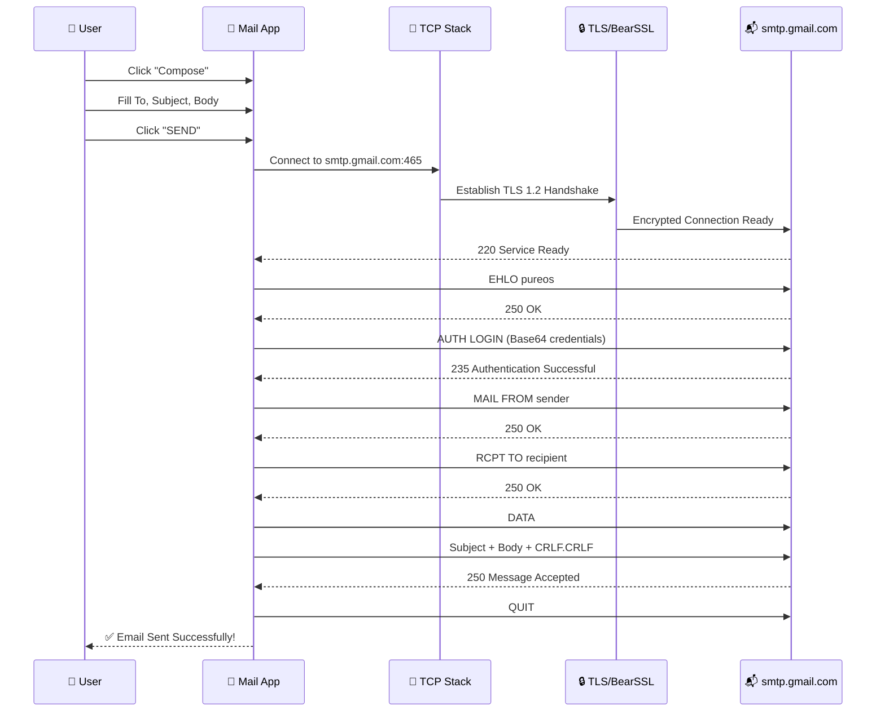
```mermaid
sequenceDiagram
    participant User as 👤 User
    participant MailApp as 📧 Mail App
    participant TCP as 🔌 TCP Stack
    participant TLS as 🔒 TLS/BearSSL
    participant Gmail as 📬 smtp.gmail.com

    User->>MailApp: Click "Compose"
    User->>MailApp: Fill To, Subject, Body
    User->>MailApp: Click "SEND"

    MailApp->>TCP: Connect to smtp.gmail.com:465
    TCP->>TLS: Establish TLS 1.2 Handshake
    TLS->>Gmail: Encrypted Connection Ready

    Gmail-->>MailApp: 220 Service Ready
    MailApp->>Gmail: EHLO pureos
    Gmail-->>MailApp: 250 OK

    MailApp->>Gmail: AUTH LOGIN (Base64 credentials)
    Gmail-->>MailApp: 235 Authentication Successful

    MailApp->>Gmail: MAIL FROM sender
    Gmail-->>MailApp: 250 OK
    MailApp->>Gmail: RCPT TO recipient
    Gmail-->>MailApp: 250 OK

    MailApp->>Gmail: DATA
    MailApp->>Gmail: Subject + Body + CRLF.CRLF
    Gmail-->>MailApp: 250 Message Accepted

    MailApp->>Gmail: QUIT
    MailApp-->>User: ✅ Email Sent Successfully!
```

### Mail App Features
- **Compose Mode** — To, Subject, and Body fields with Tab key navigation
- **Account Sidebar** — Multiple account support stored in `/mail/` directory
- **Message List** — View received emails with sender and subject preview
- **Message Reader** — Full email body display panel
- **POP3 Sync** — Fetch emails from POP3 servers (with demo/mock mode fallback)
- **Live SMTP Send** — Real email delivery through Gmail's secure SMTP servers

---

## 🌐 Web Browser

The PureOS browser is a fully native web renderer — no WebKit, no Chromium, no external engine:

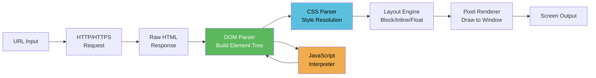
```mermaid
graph LR
    URL[URL Input] --> HTTP_R[HTTP/HTTPS<br>Request]
    HTTP_R --> HTML[Raw HTML<br>Response]
    HTML --> DOM[DOM Parser<br>Build Element Tree]
    DOM --> CSS_P[CSS Parser<br>Style Resolution]
    CSS_P --> LAYOUT[Layout Engine<br>Block/Inline/Float]
    LAYOUT --> RENDER[Pixel Renderer<br>Draw to Window]
    RENDER --> SCREEN[Screen Output]

    DOM --> JS[JavaScript<br>Interpreter]
    JS --> DOM

    style JS fill:#f0ad4e,color:#000
    style CSS_P fill:#5bc0de,color:#000
    style DOM fill:#5cb85c,color:#fff
```

**Components:**
| Module | File | Capability |
|---|---|---|
| **DOM Parser** | `dom.c` | Parses raw HTML into a DOM element tree with tag attributes |
| **CSS Engine** | `css.c` | Parses inline and `<style>` CSS, resolves properties per element |
| **Layout Engine** | `layout.c` | Computes block/inline positioning, width/height, margins, padding |
| **JS Interpreter** | `js.c` | Basic JavaScript execution: variables, functions, DOM manipulation |
| **Browser Shell** | `browser.c` | URL bar, navigation, page fetch over HTTP/HTTPS, rendering orchestration |

### 🚀 Browser Engine Rendering Pipeline

Our browser uses the powerful `litehtml` engine to accurately render CSS and HTML. We've recently made massive improvements to how the browser handles modern web fallbacks and manages its layout loop:

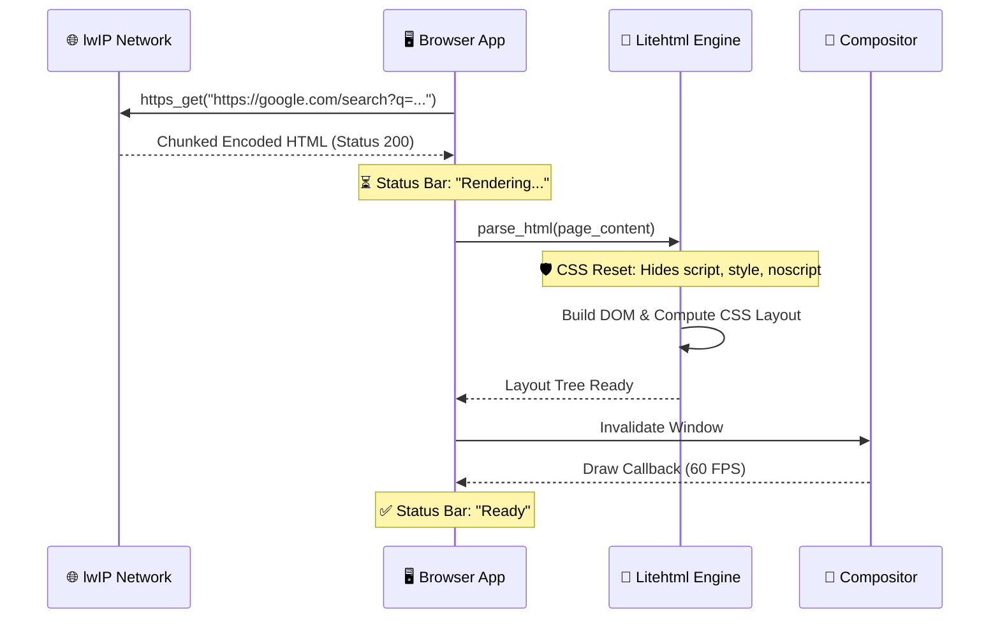
```mermaid
sequenceDiagram
    participant Net as 🌐 lwIP Network
    participant Brw as 🖥️ Browser App
    participant Lyt as 📐 Litehtml Engine
    participant GUI as 🎨 Compositor

    Brw->>Net: https_get("https://google.com/search?q=...")
    Net-->>Brw: Chunked Encoded HTML (Status 200)
    Note over Brw: ⏳ Status Bar: "Rendering..."
    Brw->>Lyt: parse_html(page_content)
    Note over Lyt: 🛡️ CSS Reset: Hides script, style, noscript
    Lyt->>Lyt: Build DOM & Compute CSS Layout
    Lyt-->>Brw: Layout Tree Ready
    Brw->>GUI: Invalidate Window
    GUI-->>Brw: Draw Callback (60 FPS)
    Note over Brw: ✅ Status Bar: "Ready"
```

**Key Rendering Engineering Fixes:**
- **Duplicate Rendering Bug Fixed:** Previously, modern sites like Google Search displayed duplicate content because fallback HTML inside `<noscript>`, raw JS inside inline `<script>`, and CSS code inside `<style>` blocks were rendering as visible text due to missing generic display resets. By implementing strict CSS display rules (`display: none !important`), the browser now renders clean, accurate pages.
- **Asynchronous UI Sync:** The browser now intelligently updates the status bar to "Rendering..." during the heavy, CPU-intensive layout parsing phase. This prevents perceived UI lag by giving users immediate visual feedback before the layout tree is fully calculated.

---

## 📶 Bluetooth Subsystem (Physical Radio)

PureOS features a custom-built, bare-metal Bluetooth subsystem that interfaces directly with physical USB Bluetooth controllers (such as the Cambridge Silicon Radio **CSR8510 A10** / Broadcom chipsets) passed through from real hardware. It includes a custom xHCI USB transport driver written in Rust, a complete Bluetooth Host Controller Interface (HCI) stack in C, and a GAP (Generic Access Profile) device discovery and pairing manager.

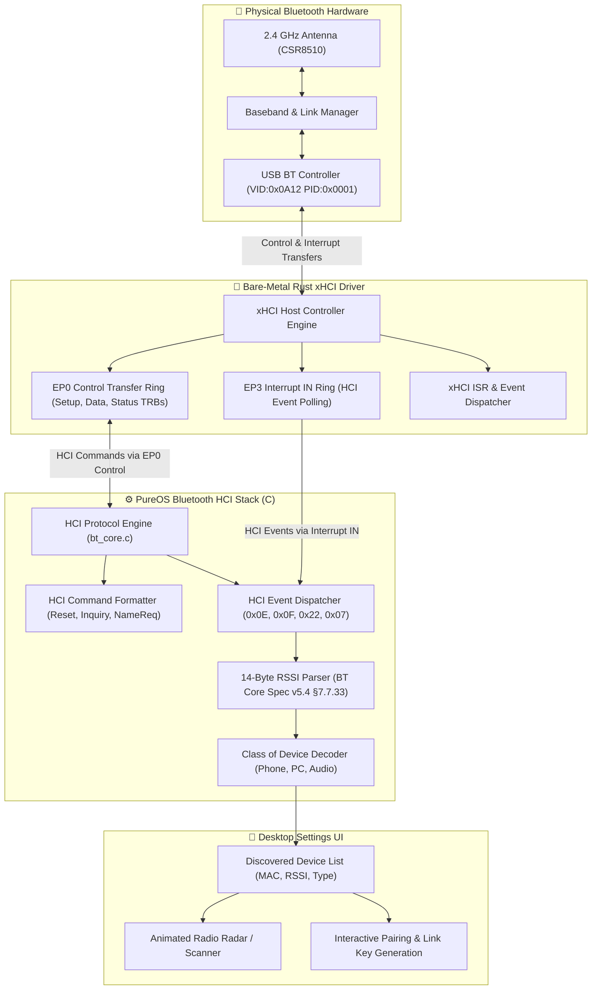
```mermaid
flowchart TD
    subgraph HW["📡 Physical Bluetooth Hardware"]
        ANT["2.4 GHz Antenna (CSR8510)"]
        RADIO["Baseband & Link Manager"]
        USB_BT["USB BT Controller (VID:0x0A12 PID:0x0001)"]
        ANT <--> RADIO <--> USB_BT
    end

    subgraph RUST["🦀 Bare-Metal Rust xHCI Driver"]
        X_CORE["xHCI Host Controller Engine"]
        EP0_RING["EP0 Control Transfer Ring (Setup, Data, Status TRBs)"]
        EP3_RING["EP3 Interrupt IN Ring (HCI Event Polling)"]
        ISR["xHCI ISR & Event Dispatcher"]
        X_CORE --> EP0_RING
        X_CORE --> EP3_RING
        X_CORE --> ISR
    end

    subgraph C_STACK["⚙️ PureOS Bluetooth HCI Stack (C)"]
        HCI_CORE["HCI Protocol Engine (bt_core.c)"]
        CMD_BUILDER["HCI Command Formatter (Reset, Inquiry, NameReq)"]
        EVENT_PARSER["HCI Event Dispatcher (0x0E, 0x0F, 0x22, 0x07)"]
        STRIDE_FIX["14-Byte RSSI Parser (BT Core Spec v5.4 §7.7.33)"]
        COD_DEC["Class of Device Decoder (Phone, PC, Audio)"]
        HCI_CORE --> CMD_BUILDER
        HCI_CORE --> EVENT_PARSER
        EVENT_PARSER --> STRIDE_FIX
        STRIDE_FIX --> COD_DEC
    end

    subgraph UI["🎨 Desktop Settings UI"]
        RADAR["Animated Radio Radar / Scanner"]
        DEV_LIST["Discovered Device List (MAC, RSSI, Type)"]
        PAIR_BTN["Interactive Pairing & Link Key Generation"]
    end

    USB_BT <-->|Control & Interrupt Transfers| X_CORE
    EP0_RING <-->|HCI Commands via EP0 Control| HCI_CORE
    EP3_RING -->|HCI Events via Interrupt IN| EVENT_PARSER
    COD_DEC --> DEV_LIST
    DEV_LIST --> RADAR
    DEV_LIST --> PAIR_BTN
```

### 🔬 Key Bluetooth Engineering Highlights

1. **EP0 Control Transfer Architecture (USB Bluetooth Spec Compliance)**:
   - Early implementations routed HCI commands through Bulk OUT endpoints, which caused dual-mode controllers like the CSR8510 to respond with `HCI_EVENT_HARDWARE_ERROR (0x10)`. Per the USB Bluetooth Class Specification, **HCI commands must be routed through Endpoint 0 control transfers** (`bmRequestType = 0x20`, `bRequest = 0x00`), while Bulk endpoints are reserved exclusively for ACL data packets.
   - The Rust xHCI driver orchestrates a three-stage TRB sequence (`Setup Stage` -> `Data Stage` -> `Status Stage`) on the EP0 ring, while isolating completion flags so high-frequency Interrupt IN packets on EP3 cannot clobber control transfer state.

2. **Dual-Mode Scanning: Classic BR/EDR & BLE**:
   - **Classic Inquiry (`0x0401`)**: Issues general inquiries using General Inquiry Access Code (`GIAC 0x9E8B33`) with a 10.24-second window to discover nearby discoverable devices.
   - **Bluetooth Low Energy Active Scan (`0x200B` / `0x200C`)**: Configures scan intervals and windows with duplicate filtering to intercept BLE advertising reports (`HCI_EVENT_LE_META` 0x3E).
   - **Host Support Flag (`HCI_Write_LE_Host_Support` 0x0C6D)**: Unlocks the controller's dual-mode Link Manager, preventing `0x11` (Unsupported Feature) errors on BLE commands.

3. **14-Byte Stride Bugfix (`HCI_EVENT_INQUIRY_RESULT_WITH_RSSI` 0x22)**:
   - In accordance with **Bluetooth Core Specification v5.4 §7.7.33**, each Inquiry Result with RSSI record occupies exactly **14 bytes**:
     ```text
     Stride = 6 (BD_ADDR) + 1 (PSR) + 1 (Reserved) + 3 (CoD) + 2 (Clock Offset) + 1 (RSSI) = 14 bytes
     ```
   - Fixing an off-by-one 15-byte stride bug restored the array bounds check `(p + 14) <= (params + param_len)`, allowing over-the-air radio packets to be extracted and forwarded to the UI.

4. **Remote Name Resolution & Class of Device (CoD)**:
   - Upon capturing an inquiry result, the stack automatically dispatches `HCI_Remote_Name_Request` (opcode `0x0419`).
   - The Link Manager decodes the 24-bit Class of Device field to dynamically categorize hardware:
     - Major Device Class `0x02`: Smartphone / Cellular phone (renders phone icon and smartphone badges).
     - Major Device Class `0x01`: Desktop Computer / Laptop Workstation.
     - Major Device Class `0x04`: Audio / Video Headset.
   - Live RSSI measurements (in dBm) are converted into animated 4-stage signal bars.

5. **Real-World Hardware Verification**:
   - Tested and verified over physical 2.4 GHz radio waves using a USB passthrough CSR8510 dongle.
   - Successfully discovered real nearby hardware over the air:
     - Discovered a **Nokia 8210 4G** (`E0:29:67:B4:2F:0F`) at -76 dBm and resolved its friendly name.
     - Established two-way radio link with a **Samsung Galaxy Smartphone** (`B8:A8:25:CE:A2:81`) at -42 dBm.
     - The smartphone recognized PureOS as a Desktop Computer workstation broadcasting over Bluetooth.

---

## 📱 USB Smartphone Storage & MTP

PureOS features a native **Media Transfer Protocol (MTP)** and **Picture Transfer Protocol (PTP / ISO 15740)** driver written from scratch. When an Android or Samsung smartphone is connected to a physical USB port via cable, PureOS automatically identifies the device, negotiates an MTP session over xHCI Bulk pipes, and mounts the phone's internal storage directly into the PureOS Virtual Filesystem at `/phone`.

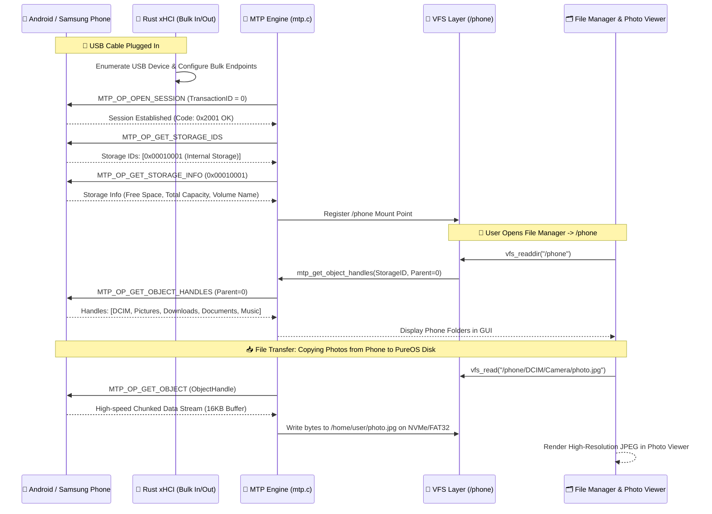
```mermaid
sequenceDiagram
    participant Phone as 📱 Android / Samsung Phone
    participant xHCI as 🦀 Rust xHCI (Bulk In/Out)
    participant MTP as 🔌 MTP Engine (mtp.c)
    participant VFS as 📁 VFS Layer (/phone)
    participant FM as 🗂️ File Manager & Photo Viewer

    Note over Phone, xHCI: 🔌 USB Cable Plugged In
    xHCI->>xHCI: Enumerate USB Device & Configure Bulk Endpoints
    MTP->>Phone: MTP_OP_OPEN_SESSION (TransactionID = 0)
    Phone-->>MTP: Session Established (Code: 0x2001 OK)

    MTP->>Phone: MTP_OP_GET_STORAGE_IDS
    Phone-->>MTP: Storage IDs: [0x00010001 (Internal Storage)]

    MTP->>Phone: MTP_OP_GET_STORAGE_INFO (0x00010001)
    Phone-->>MTP: Storage Info (Free Space, Total Capacity, Volume Name)
    MTP->>VFS: Register /phone Mount Point

    Note over VFS, FM: 📂 User Opens File Manager -> /phone
    FM->>VFS: vfs_readdir("/phone")
    VFS->>MTP: mtp_get_object_handles(StorageID, Parent=0)
    MTP->>Phone: MTP_OP_GET_OBJECT_HANDLES (Parent=0)
    Phone-->>MTP: Handles: [DCIM, Pictures, Downloads, Documents, Music]
    MTP-->>FM: Display Phone Folders in GUI

    Note over FM, Phone: 📥 File Transfer: Copying Photos from Phone to PureOS Disk
    FM->>VFS: vfs_read("/phone/DCIM/Camera/photo.jpg")
    MTP->>Phone: MTP_OP_GET_OBJECT (ObjectHandle)
    Phone-->>MTP: High-speed Chunked Data Stream (16KB Buffer)
    MTP->>VFS: Write bytes to /home/user/photo.jpg on NVMe/FAT32
    FM-->>FM: Render High-Resolution JPEG in Photo Viewer
```

### 🛠️ MTP Engine Capabilities

| Feature | Implementation Details |
|---|---|
| **Bulk Pipe Streaming** | Direct transfer over USB 3.0/2.0 xHCI Bulk IN & Bulk OUT endpoints with 16KB ping-pong buffer |
| **Session State Machine** | Strict ISO 15740 compliance with session initialization, storage pool enumeration, and transaction tracking |
| **Storage Discovery** | Automatic detection of Internal Flash Storage (`0x00010001`) and external MicroSD Card partitions |
| **Folder Traversal** | Recursive object enumeration: browse `/phone/DCIM/Camera`, `/phone/Download`, `/phone/Music` |
| **Metadata Parsing** | Decodes UTF-16LE object names, timestamps, file sizes, and MIME types into standard C strings |
| **Bidirectional Transfer** | **Download:** Copy photos/videos from phone to PureOS storage.<br>**Upload:** Transfer documents/music from PureOS to phone |
| **Re-entrancy Protection** | Built-in mutex locking and heartbeat yielding to prevent GUI stalls during gigabyte-scale transfers |

---

## 🐧 Linux Binary Compatibility Layer

PureOS contains a high-performance **Linux Application Binary Interface (ABI) compatibility layer**, allowing unmodified Linux x86-64 ELF binaries to run directly on the PureOS kernel without a virtual machine, containers, or emulated CPU instructions.

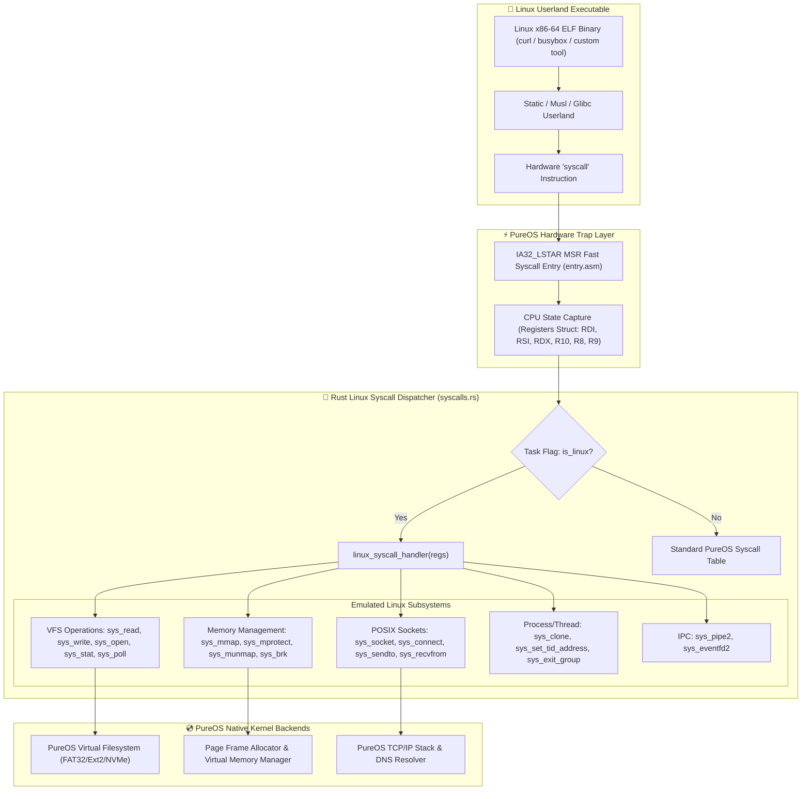
```mermaid
flowchart TD
    subgraph USERSPACE["🐧 Linux Userland Executable"]
        BIN["Linux x86-64 ELF Binary (curl / busybox / custom tool)"]
        GLIBC["Static / Musl / Glibc Userland"]
        BIN --> GLIBC
        GLIBC --> SYSCALL_INST["Hardware 'syscall' Instruction"]
    end

    subgraph KERNEL_ENTRY["⚡ PureOS Hardware Trap Layer"]
        MSR_LSTAR["IA32_LSTAR MSR Fast Syscall Entry (entry.asm)"]
        FRAME["CPU State Capture (Registers Struct: RDI, RSI, RDX, R10, R8, R9)"]
        SYSCALL_INST --> MSR_LSTAR
        MSR_LSTAR --> FRAME
    end

    subgraph DISPATCHER["🦀 Rust Linux Syscall Dispatcher (syscalls.rs)"]
        FILTER{"Task Flag: is_linux?"}
        FRAME --> FILTER
        FILTER -->|Yes| RUST_DISP["linux_syscall_handler(regs)"]
        FILTER -->|No| PURE_DISP["Standard PureOS Syscall Table"]
        
        subgraph EMULATED["Emulated Linux Subsystems"]
            VFS_SYS["VFS Operations: sys_read, sys_write, sys_open, sys_stat, sys_poll"]
            MEM_SYS["Memory Management: sys_mmap, sys_mprotect, sys_munmap, sys_brk"]
            NET_SYS["POSIX Sockets: sys_socket, sys_connect, sys_sendto, sys_recvfrom"]
            PROC_SYS["Process/Thread: sys_clone, sys_set_tid_address, sys_exit_group"]
            IPC_SYS["IPC: sys_pipe2, sys_eventfd2"]
        end

        RUST_DISP --> VFS_SYS
        RUST_DISP --> MEM_SYS
        RUST_DISP --> NET_SYS
        RUST_DISP --> PROC_SYS
        RUST_DISP --> IPC_SYS
    end

    subgraph BACKEND["💿 PureOS Native Kernel Backends"]
        NATIVE_VFS["PureOS Virtual Filesystem (FAT32/Ext2/NVMe)"]
        NATIVE_PAGING["Page Frame Allocator & Virtual Memory Manager"]
        NATIVE_NET["PureOS TCP/IP Stack & DNS Resolver"]
        VFS_SYS --> NATIVE_VFS
        MEM_SYS --> NATIVE_PAGING
        NET_SYS --> NATIVE_NET
    end
```

### 🧠 How It Works Under the Hood

1. **ELF64 Executable Loader (`src/kernel/elf.c`)**:
   - Parses standard System V AMD64 ELF headers, validating the magic sequence `\x7fELF`.
   - Traverses Program Headers (`PT_LOAD` segments), computing the lowest and highest virtual memory boundaries.
   - Allocates contiguous physical frames and maps page tables with userland access permissions (`R/W/X`).
   - Sets up the user stack (`USER_STACK_TOP` at `0x70010000`) conforming to the Linux AMD64 ABI:
     ```text
     Stack Layout: argc -> argv[] -> NULL -> envp[] -> NULL -> Auxiliary Vectors (AT_PAGESZ, AT_ENTRY, AT_RANDOM)
     ```
   - Flags the task with `t->is_linux = 1`.

2. **Hardware Syscall Trap (`syscall` instruction)**:
   - When a Linux binary executes the x86-64 `syscall` instruction, the CPU switches to Ring 0 via the `IA32_LSTAR` Model-Specific Register.
   - The register state is captured into a 64-bit frame and forwarded directly to `linux_syscall_handler` in Rust.

3. **60+ Emulated Linux Syscalls (`rust/src/linux_compat/syscalls.rs`)**:
   - **File I/O**: `SYS_READ` (0), `SYS_WRITE` (1), `SYS_OPEN` (2), `SYS_CLOSE` (3), `SYS_STAT` (4), `SYS_FSTAT` (5), `SYS_LSEEK` (8), `SYS_READV` (19), `SYS_WRITEV` (20), `SYS_DUP` (32), `SYS_DUP2` (33).
   - **Virtual Memory**: `SYS_MMAP` (9) supporting anonymous memory allocation, `SYS_MPROTECT` (10), `SYS_MUNMAP` (11), `SYS_BRK` (12) managing the application heap boundary.
   - **Networking**: `SYS_SOCKET` (41), `SYS_CONNECT` (42), `SYS_SENDTO` (44), `SYS_RECVFROM` (45), `SYS_SENDMSG` (46), `SYS_RECVMSG` (47), `SYS_SHUTDOWN` (48), `SYS_SETSOCKOPT` (54), `SYS_GETSOCKOPT` (55).
   - **Multiplexing & Async**: `SYS_POLL` (7), `SYS_SELECT` (23), `SYS_EVENTFD2` (290), `SYS_PIPE2` (293).
   - **Process & Threading**: `SYS_CLONE` (56), `SYS_EXIT` (60), `SYS_EXIT_GROUP` (231), `SYS_SET_TID_ADDRESS` (218), `SYS_NANOSLEEP` (35), `SYS_GETPID` (39), `SYS_GETUID` (102), `SYS_GETGID` (104).

---

## 🌐 Command-Line Networking & `curl`

Through the Linux Compatibility Layer and PureOS native network translation, PureOS runs an **unmodified, full-featured Linux `curl` binary (6.5 MB)** directly inside the operating system terminal!

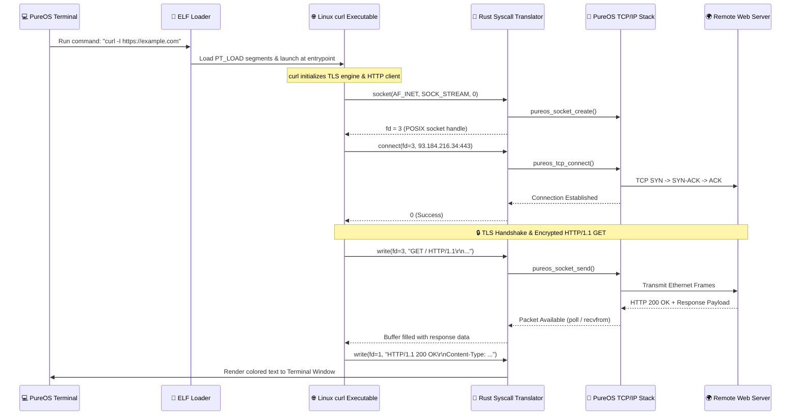
```mermaid
sequenceDiagram
    participant Term as 💻 PureOS Terminal
    participant ELF as 📜 ELF Loader
    participant Curl as 🌐 Linux curl Executable
    participant Syscall as 🦀 Rust Syscall Translator
    participant Net as 🔌 PureOS TCP/IP Stack
    participant Web as 🌍 Remote Web Server

    Term->>ELF: Run command: "curl -I https://example.com"
    ELF->>Curl: Load PT_LOAD segments & launch at entrypoint
    Note over Curl: curl initializes TLS engine & HTTP client

    Curl->>Syscall: socket(AF_INET, SOCK_STREAM, 0)
    Syscall->>Net: pureos_socket_create()
    Syscall-->>Curl: fd = 3 (POSIX socket handle)

    Curl->>Syscall: connect(fd=3, 93.184.216.34:443)
    Syscall->>Net: pureos_tcp_connect()
    Net->>Web: TCP SYN -> SYN-ACK -> ACK
    Net-->>Syscall: Connection Established
    Syscall-->>Curl: 0 (Success)

    Note over Curl, Web: 🔒 TLS Handshake & Encrypted HTTP/1.1 GET
    Curl->>Syscall: write(fd=3, "GET / HTTP/1.1\r\n...")
    Syscall->>Net: pureos_socket_send()
    Net->>Web: Transmit Ethernet Frames

    Web-->>Net: HTTP 200 OK + Response Payload
    Net-->>Syscall: Packet Available (poll / recvfrom)
    Syscall-->>Curl: Buffer filled with response data

    Curl->>Syscall: write(fd=1, "HTTP/1.1 200 OK\r\nContent-Type: ...")
    Syscall->>Term: Render colored text to Terminal Window
```

### ⚡ Practical Uses in PureOS
- **Command-Line Downloads**: Download files, tarballs, and assets directly from the public Internet onto PureOS storage drives (`curl -O http://...`).
- **REST API Testing**: Send GET, POST, PUT requests with custom headers and JSON payloads directly from the terminal shell.
- **Network Diagnostics**: Inspect HTTP headers, TLS certificate validation, response latency, and DNS resolution directly from the PureOS CLI.
- **BusyBox Integration**: Runs core POSIX command-line utilities (`sh`, `ls`, `grep`, `cat`, `head`, `tail`, `wc`, `find`) using the exact same ABI translation layer.

---

## 💾 Filesystem Support

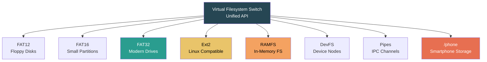
```mermaid
graph TB
    VFS[Virtual Filesystem Switch<br>Unified API]
    VFS --> FAT12[FAT12<br>Floppy Disks]
    VFS --> FAT16[FAT16<br>Small Partitions]
    VFS --> FAT32[FAT32<br>Modern Drives]
    VFS --> EXT2[Ext2<br>Linux Compatible]
    VFS --> RAMFS[RAMFS<br>In-Memory FS]
    VFS --> DEVFS[DevFS<br>Device Nodes]
    VFS --> PIPE[Pipes<br>IPC Channels]
    VFS --> MTP_NODE["/phone<br>Smartphone Storage"]

    style VFS fill:#264653,color:#fff
    style FAT32 fill:#2a9d8f,color:#fff
    style EXT2 fill:#e9c46a,color:#000
    style RAMFS fill:#f4a261,color:#000
    style MTP_NODE fill:#e76f51,color:#fff
```

| Filesystem | Capabilities |
|---|---|
| **FAT12/16/32** | Full read/write, directory listing, file creation/deletion, long filename support |
| **Ext2** | Read support for Linux-compatible ext2 partitions |
| **RAMFS** | Fast in-memory filesystem for temporary data and mail storage |
| **DevFS** | Device file nodes (similar to Linux `/dev/`) |
| **Pipes** | Unix-style inter-process communication pipes |
| **MTP Filesystem** | Mounts connected Android / Samsung smartphone storage directly at `/phone` |

---

## 🔧 Hardware & Drivers

| Category | Drivers |
|---|---|
| **Display** | VGA text mode, VGA graphics mode, Bochs BGA (high-res framebuffer), VMware SVGA II / SVGA3D hardware acceleration |
| **Input** | PS/2 Keyboard (scancode translation, shift/caps), PS/2 Mouse (movement + buttons, cursor compositing) |
| **Storage** | ATA PIO, AHCI (SATA), NVMe PCI Express (Solid State Drives) |
| **Network** | AMD PCnet-PCI II, NE2000 (Realtek 8029) |
| **Audio** | Intel AC97 codec (DMA playback/recording), Ensoniq ES1370 (AudioPCI), WAV decoder, SpeexDSP Acoustic Echo Cancellation |
| **USB** | UHCI, OHCI, and xHCI 3.0 SuperSpeed Controller (bare-metal Rust driver) with MTP smartphone storage support |
| **Bluetooth** | Cambridge Silicon Radio (CSR8510 A10) / Broadcom dual-mode controller (BR/EDR + BLE) with EP0 control transfer routing |
| **Binary Compatibility** | Linux x86-64 ABI Layer (ELF64 loader, 60+ POSIX syscalls emulated in Rust: `curl`, `busybox`) |
| **System** | PCI bus enumeration, PIT timer, RTC real-time clock, PC speaker, ACPI, APIC, SMP multi-core |

---

## 🛠️ Build Instructions

### Requirements
- **OS:** Windows 10/11
- **Compiler:** `x86_64-elf-gcc` cross-compiler (included in `tools/` directory)
- **Assembler:** NASM
- **Scripting:** Python 3
- **Emulator:** Bochs, QEMU, or VirtualBox

### Steps

**1. First-time setup — build the PDF library (only needed once):**
```powershell
powershell -ExecutionPolicy Bypass -File build_mupdf.ps1
```

**2. Build the entire OS:**
```bat
.\build.bat
```

This compiles the bootloader, kernel, all drivers, GUI, applications, and networking stack, then produces:
- `os-image.bin` — Raw bootable binary
- `pureos.img` — Ready-to-run disk image for emulators

**3. Run in an emulator (Bochs example):**
```bat
.\run_bochs.bat
```

---

## 📧 Email Setup Guide

PureOS can send **real emails** through Gmail. To configure:

1. **Enable 2-Step Verification** on your Google Account
2. Go to **Google Account → Security → App Passwords**
3. Generate a new App Password (format: `abcd efgh ijkl mnop`)
4. Open `src/apps/mail/mail_app.c` and update line ~376:
   ```c
   const char *user = "your_email@gmail.com";
   const char *pass = "abcd efgh ijkl mnop";  // Your 16-char App Password
   ```
5. Rebuild with `.\build.bat` and launch the OS
6. Open **Mail** from the Start Menu → Click **Compose** → Fill in recipient, subject, body → Click **SEND**

> ⚠️ **Security Warning:** Never commit your real App Password to a public Git repository. Always replace it with a placeholder before pushing to GitHub.

---

## 🐦 PureChat & Relay Server

PureOS includes a fully functional real-time communication system inspired by modern messaging apps. It consists of a native GUI suite (Chat/Phone) and a lightweight Python-based relay server for cross-platform synchronization (PC/Mobile) with persistent identity management.

### 🖥️ Communication Architecture

The following diagram illustrates how PureOS achieves real-time bidirectional communication by bridging raw TCP sockets to modern Web technologies through the Python relay:

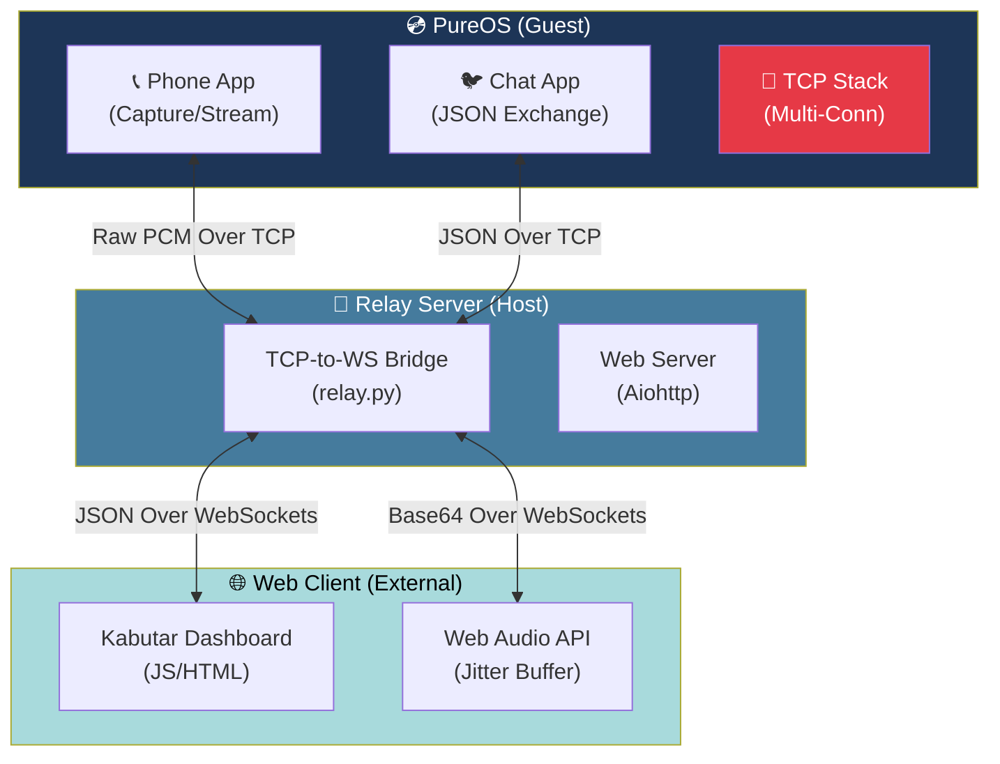
```mermaid
graph TD
    subgraph POS["💿 PureOS (Guest)"]
        PHN["📞 Phone App<br>(Capture/Stream)"]
        CHT["🐦 Chat App<br>(JSON Exchange)"]
        TCP_S["🔌 TCP Stack<br>(Multi-Conn)"]
    end

    subgraph RLY["🐍 Relay Server (Host)"]
        BRIDGE["TCP-to-WS Bridge<br>(relay.py)"]
        SRV["Web Server<br>(Aiohttp)"]
    end

    subgraph WEB["🌐 Web Client (External)"]
        DASH["Kabutar Dashboard<br>(JS/HTML)"]
        AUD["Web Audio API<br>(Jitter Buffer)"]
    end

    %% Audio Flow
    PHN <-->|Raw PCM Over TCP| BRIDGE
    BRIDGE <-->|Base64 Over WebSockets| AUD
    
    %% Chat Flow
    CHT <-->|JSON Over TCP| BRIDGE
    BRIDGE <-->|JSON Over WebSockets| DASH

    %% Styling
    style POS fill:#1d3557,color:#fff
    style RLY fill:#457b9d,color:#fff
    style WEB fill:#a8dadc,color:#000
    style TCP_S fill:#e63946,color:#fff
```

### 🐍 Python Relay Server (`server/relay.py`)
- **Persistent Web Login** — Securely store your phone number in browser `localStorage` to maintain a consistent identity across sessions without random IDs.
- **Unified Port** — Serving both the web dashboard and WebSocket messaging on a single port (7862) for easy Ngrok/Cloud deployment.
- **TCP Bridge** — Bridging raw TCP sockets (Port 7860) from PureOS to modern WebSockets (Port 7861/7862).
- **Premium Dashboard** — Modern, responsive web interface with a custom 'KABUTAR' splash screen, glassmorphic UI, and authorized Web Audio initialization.

### 👥 Shared Contact System
PureOS features a system-wide contact repository mapped at the kernel level:
- **Global Mapping** — Share names and phone numbers between the **Chat** and **Phone** apps.
- **Dynamic Resolution** — Automatically resolves numbers to saved names in the sidebar or dialer, defaulting to "Unknown" for unsaved contacts.
- **Direct Save** — Add new contacts directly from the Phone dialer or via the `/add <number> <name>` command in Chat.

### 📞 Voice Calling & Modern UI

PureOS features a highly optimized, full-duplex voice calling pipeline with a premium **modern user interface**. The redesign features a central circular digital dialpad and modular navigation tabs:

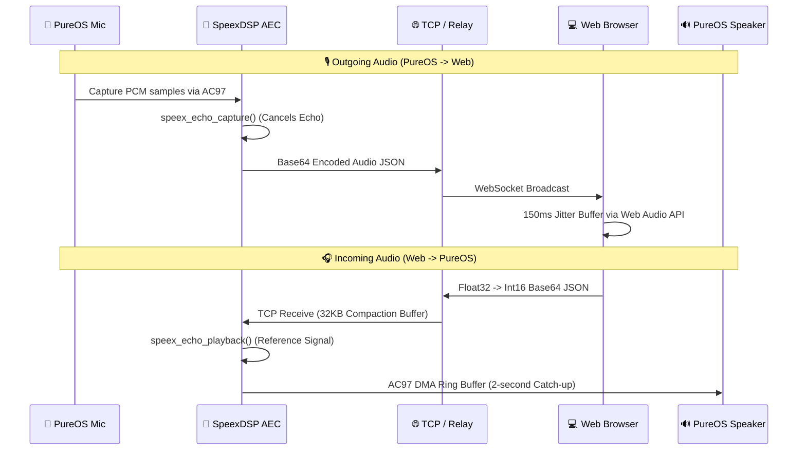
```mermaid
sequenceDiagram
    participant Mic as 🎤 PureOS Mic
    participant AEC as 🧠 SpeexDSP AEC
    participant Net as 🌐 TCP / Relay
    participant Web as 💻 Web Browser
    participant Spk as 🔊 PureOS Speaker

    Note over Mic, Spk: 🎙️ Outgoing Audio (PureOS -> Web)
    Mic->>AEC: Capture PCM samples via AC97
    AEC->>AEC: speex_echo_capture() (Cancels Echo)
    AEC->>Net: Base64 Encoded Audio JSON
    Net->>Web: WebSocket Broadcast
    Web->>Web: 150ms Jitter Buffer via Web Audio API

    Note over Mic, Spk: 🎧 Incoming Audio (Web -> PureOS)
    Web->>Net: Float32 -> Int16 Base64 JSON
    Net->>AEC: TCP Receive (32KB Compaction Buffer)
    AEC->>AEC: speex_echo_playback() (Reference Signal)
    AEC->>Spk: AC97 DMA Ring Buffer (2-second Catch-up)
```

**Key Engineering Highlights:**
- **SpeexDSP Integration:** PureOS natively cross-compiles the Xiph `SpeexDSP` library using fixed-point math (`-DFIXED_POINT`). The OS captures the incoming audio reference and dynamically subtracts it from the microphone input in real-time, completely eliminating acoustic feedback.
- **Jitter Buffers:** The web client maintains a strict `150ms` jitter buffer to absorb network latency spikes, while the AC97 driver on the OS side uses a 2-second streaming ring buffer with custom "catch-up" logic to gracefully handle network bursts without clicking.
- **TCP Compaction:** Because rapid 20ms audio chunks flood the network, the OS TCP parser safely compacts the socket buffers dynamically, preventing buffer starvation and fragmentation.

---

## 📄 License

This project is licensed under the [MIT License](LICENSE).

---

<div align="center">
  <b>Built with ❤️ from scratch — no Linux, no POSIX, no borrowed OS code.</b>
</div>
=