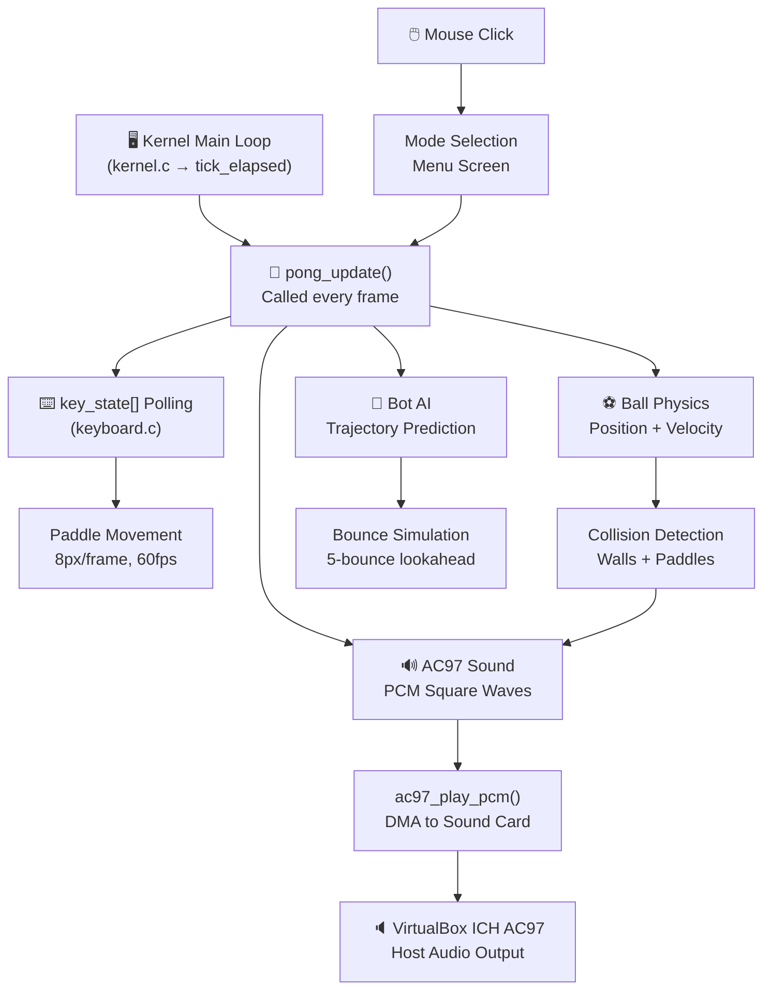
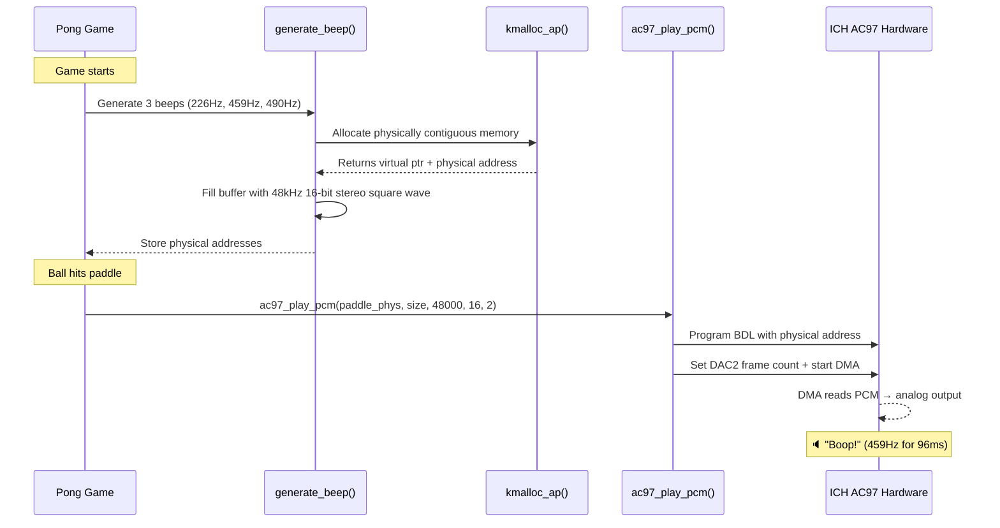
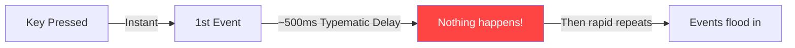
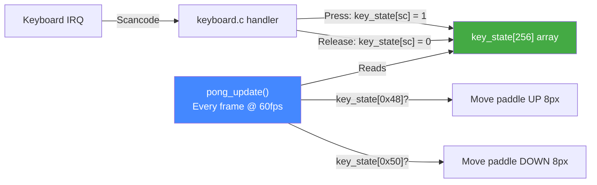
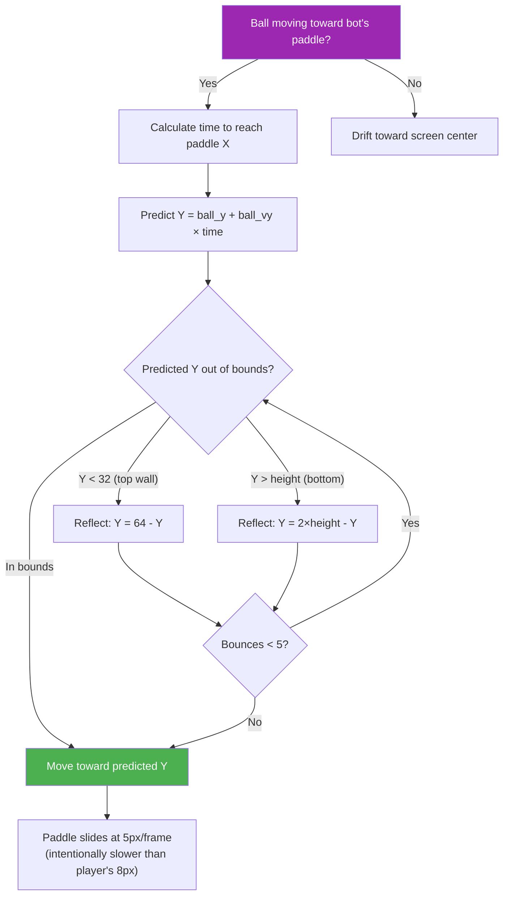
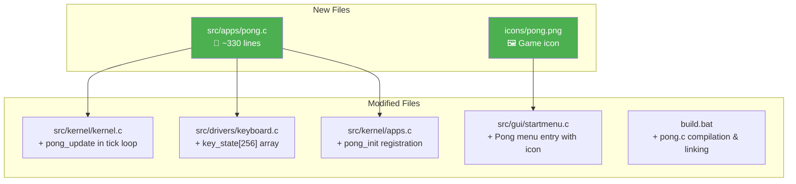

# 🏓 Pong Game — PureOS Integration Summary

> **Commit**: `9805b0b` → pushed to [github.com/Rudrapatel330/PureOS](https://github.com/Rudrapatel330/PureOS)
> **Files Changed**: 7 files, +436 lines, -12 lines


---

## 🎮 Game Modes

| Mode | Description | Controls |
|------|-------------|----------|
| **1 Player** | You vs AI Bot | ↑↓ Arrow Keys |
| **2 Players** | Local multiplayer | P1: `W`/`S` — P2: ↑↓ Arrow Keys |
| **Bot vs Bot** | Spectator mode — two AIs battle it out | None (just watch!) |

---

## 🏗️ System Architecture

The Pong game is deeply integrated into PureOS's kernel event loop, not running as an isolated process. Here's how every component connects:



---

## 🔊 Audio Pipeline — From Math to Speaker

Instead of using the primitive PC Speaker (which VirtualBox ignores with ICH AC97), we synthesize digital audio waveforms in memory and send them directly to the sound card via DMA.



### Historical Arcade Frequencies

| Game Event | Frequency | Duration | Sound Character |
|-----------|-----------|----------|-----------------|
| Ball → Wall | 226 Hz | 16 ms | Quick, low "tick" |
| Ball → Paddle | 459 Hz | 96 ms | Satisfying mid "boop" |
| Player Scores | 490 Hz | 257 ms | Long, harsh buzz |

> **Fun Fact**: 459 Hz is exactly 2× 226 Hz — a perfect octave. Allan Alcorn designed the original 1972 Pong audio using the machine's own video sync frequencies!

---

## ⌨️ Input System — Zero-Delay Keyboard Polling

### The Problem with Standard Keyboard Input



### Our Solution: Direct `key_state[]` Polling



> The paddle moves at a constant 8 pixels per frame with **zero delay** — it starts moving the instant you press and stops the instant you release. No typematic stutter.

---

## 🤖 Bot AI — Trajectory Prediction

The AI doesn't just "follow the ball." It simulates the ball's future path including wall bounces:



### Bot vs Bot Asymmetry

| Property | Bot 1 (Blue/Left) | Bot 2 (Red/Right) |
|----------|-------------------|-------------------|
| Tracking Speed | 5.5 px/frame | 5.0 px/frame |
| Dead Zone | ±8 px | ±10 px |
| Return Speed | 2.5 px/frame | 2.0 px/frame |

> This slight asymmetry ensures Bot vs Bot matches aren't perfectly mirrored — one bot occasionally outplays the other!

---

## 📁 Files Changed



| File | Change | Purpose |
|------|--------|---------|
| [pong.c](file:///d:/1os-copy/imp2%20current%20one/1os/src/apps/pong.c) | **NEW** | Complete game: physics, rendering, AI, audio |
| [keyboard.c](file:///d:/1os-copy/imp2%20current%20one/1os/src/drivers/keyboard.c) | **Modified** | Added `key_state[256]` for real-time key tracking |
| [startmenu.c](file:///d:/1os-copy/imp2%20current%20one/1os/src/gui/startmenu.c) | **Modified** | Added Pong to pinned apps with icon |
| [apps.c](file:///d:/1os-copy/imp2%20current%20one/1os/src/kernel/apps.c) | **Modified** | Registered `pong_init` in app list |
| [kernel.c](file:///d:/1os-copy/imp2%20current%20one/1os/src/kernel/kernel.c) | **Modified** | Hooked `pong_update` into main tick loop |
| [build.bat](file:///d:/1os-copy/imp2%20current%20one/1os/build.bat) | **Modified** | Added pong.c to compilation and linking pipeline |

---

## 🚀 How to Build & Run

```bash
# Build the OS, create disk image, convert to VDI
.\build.bat
python make_debug_disk.py
& "C:\Program Files\Oracle\VirtualBox\VBoxManage.exe" convertfromraw pureos.img pureos.vdi --format VDI

# Attach to VirtualBox VM and boot!
```

> [!IMPORTANT]
> VirtualBox Audio must be set to **ICH AC97** with **Audio Output enabled** for game sounds to work. Do NOT change to SoundBlaster 16 — it will break the Recorder and Phone apps.
